# Dynamic Incremental Static Regeneration (ISR)

Pemrograman Berbasis Framework

Nama: Danendra Adhipramana

Nim: 244107023011

Prodi: D4 Teknik Informatika

# Documentations

## C. Implementasi ISR Otomatis

### Bagian 1 – Tambahkan revalidate

1. Buka halaman `static.tsx` pada folder src/pages/produk

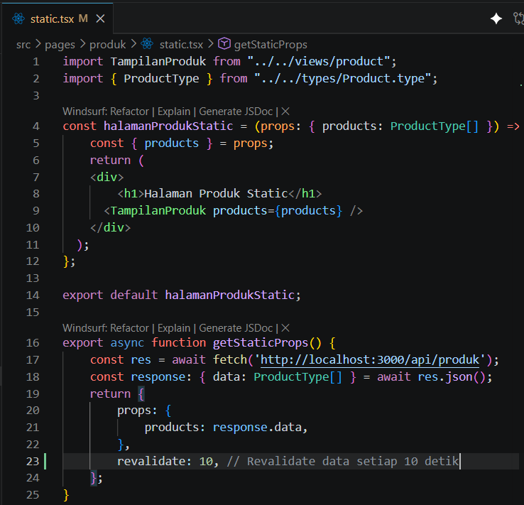

tambahkan kode `revalidate: 10,` pada line 23

Artinya:

• Setiap 10 detik halaman akan dicek ulang

• Jika ada perubahan data → cache diperbarui

### Bagian 2 – Pengujian ISR

1. Jalankan: 

o npm run build 

o npm run start

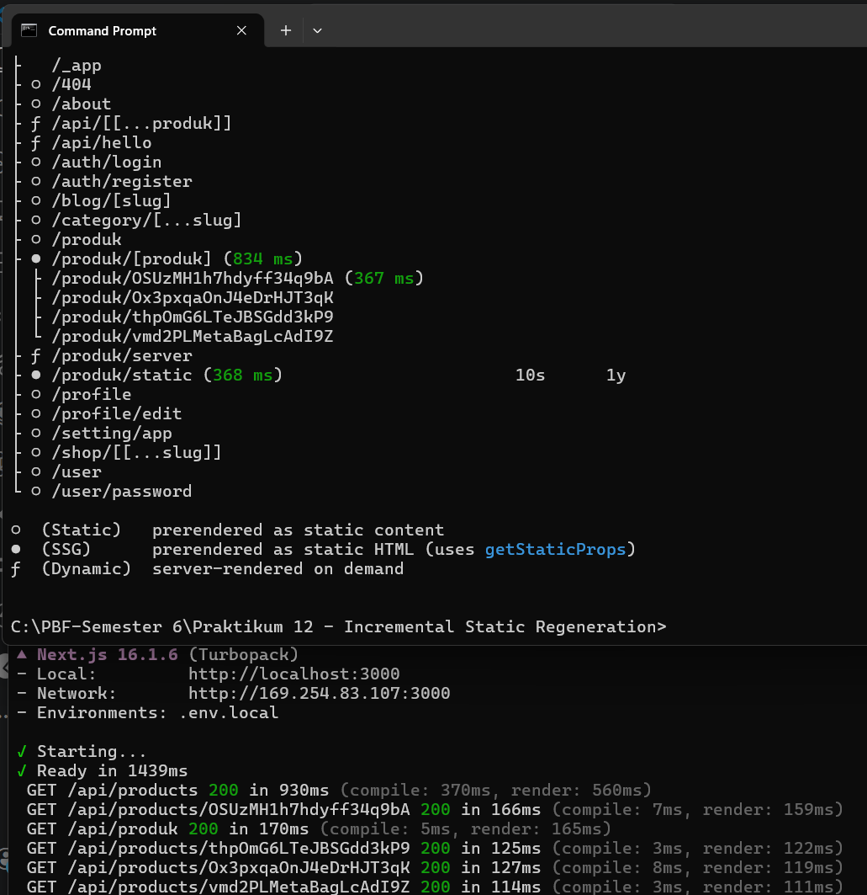

2. Tambahkan data baru di database pada firebase

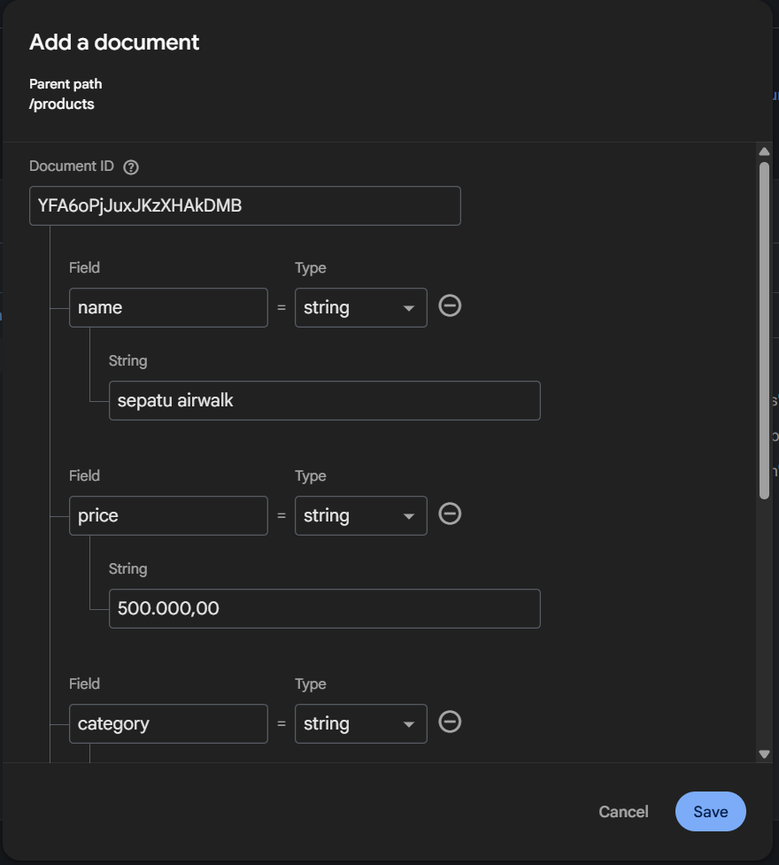

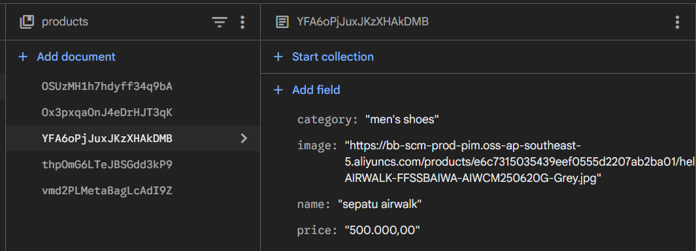

3. Refresh halaman sebelum 10 detik → Data lama.

o Sebelum 10 detik data yang akan ditampilkan masih data lama

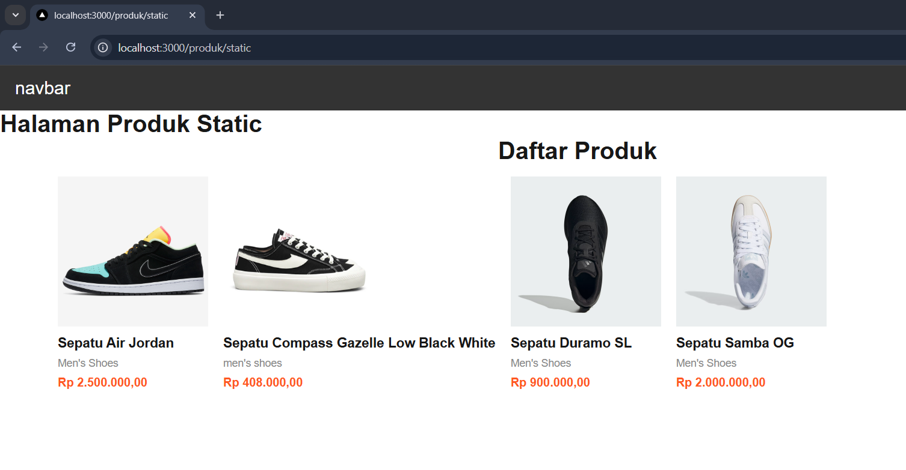

4. Refresh halaman setelah 10 detik → Data baru muncul

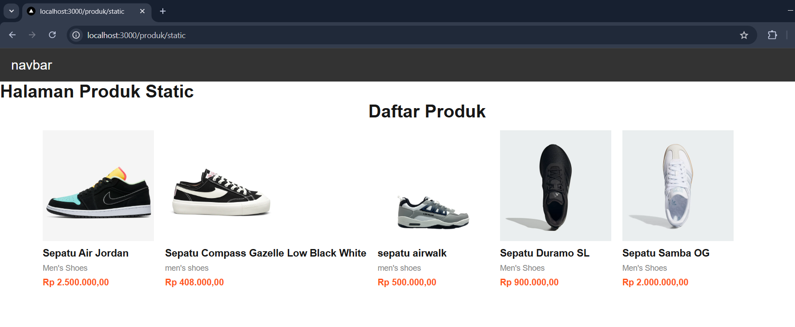

## D. On-Demand Revalidation

### Bagian 1 – Buat API Revalidate

1. Buat file `revalidate.ts` pada folder pages/api/ dan modifikasi

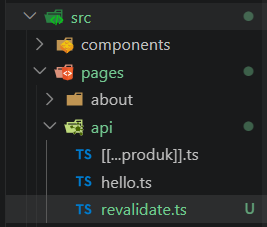

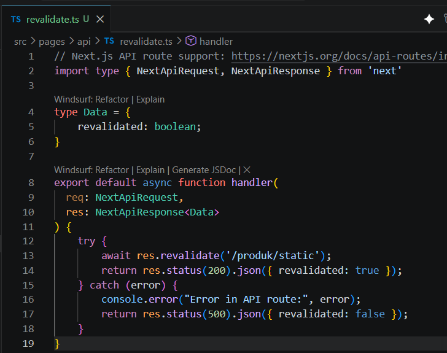

### Bagian 2 – Tambahkan Parameter Data

Untuk mengatasi hal tersebut ( pada bagian 1) maka suatu kondisi pada file `revalidate.ts`

1. Modifikasi file `revalidate.ts`

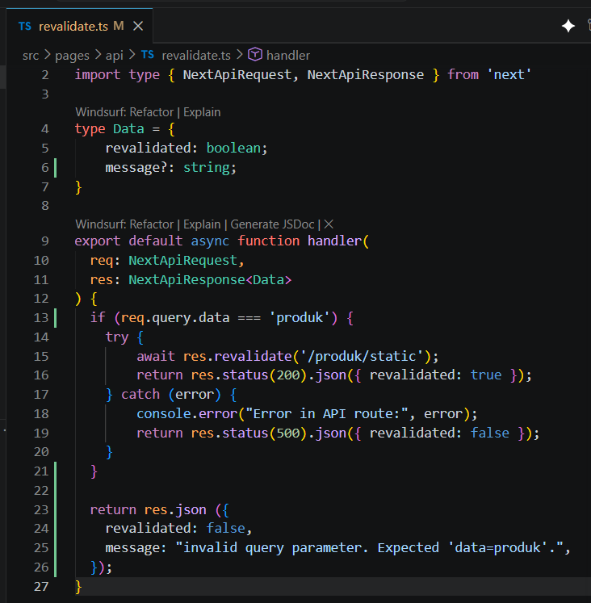

2. Uji coba menambahkan parameter dan value pada url
http://localhost:3000/api/revalidate?data=produk maka akan muncul true dan sesuai dengan kondisi (req.query.data ===”produk”)

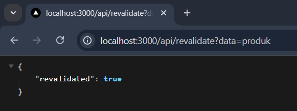

3. Uji coba dengan url http://localhost:3000/api/revalidate?data=

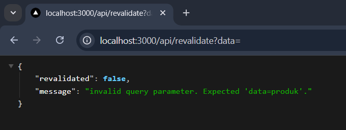

### Bagian 3 – Tambahkan Token Security

1. Buka file `.env` dan modifikasi

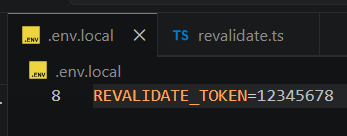

2. Modifikasi file `revalidate.ts` tambahkan kondisi pada line 13 - 17

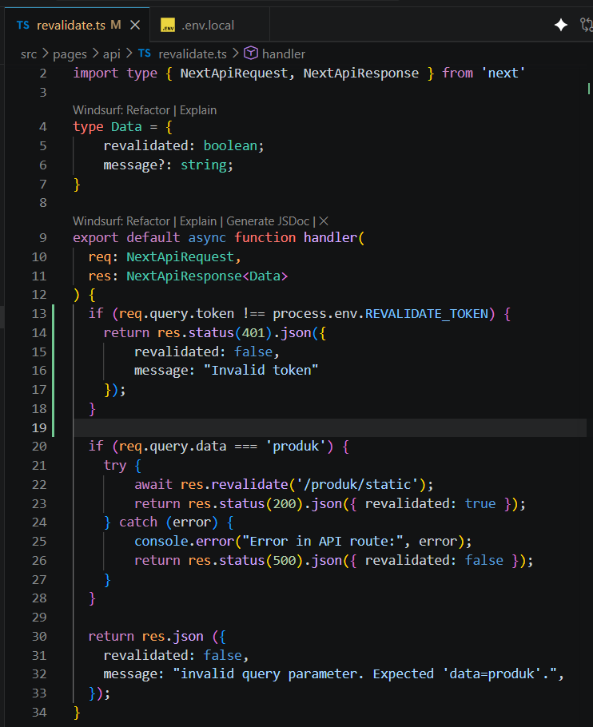

## E. Pengujian Manual Revalidation

Akses:

http://localhost:3000/api/revalidate?data=produk&token=12345678

Jika benar:

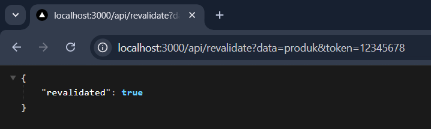

`{ revalidate: true }`

Jika token salah:

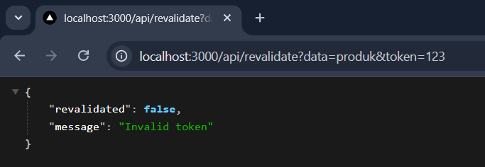

## G. Tugas Praktikum

1. Tambahkan lagi produk pada firebase

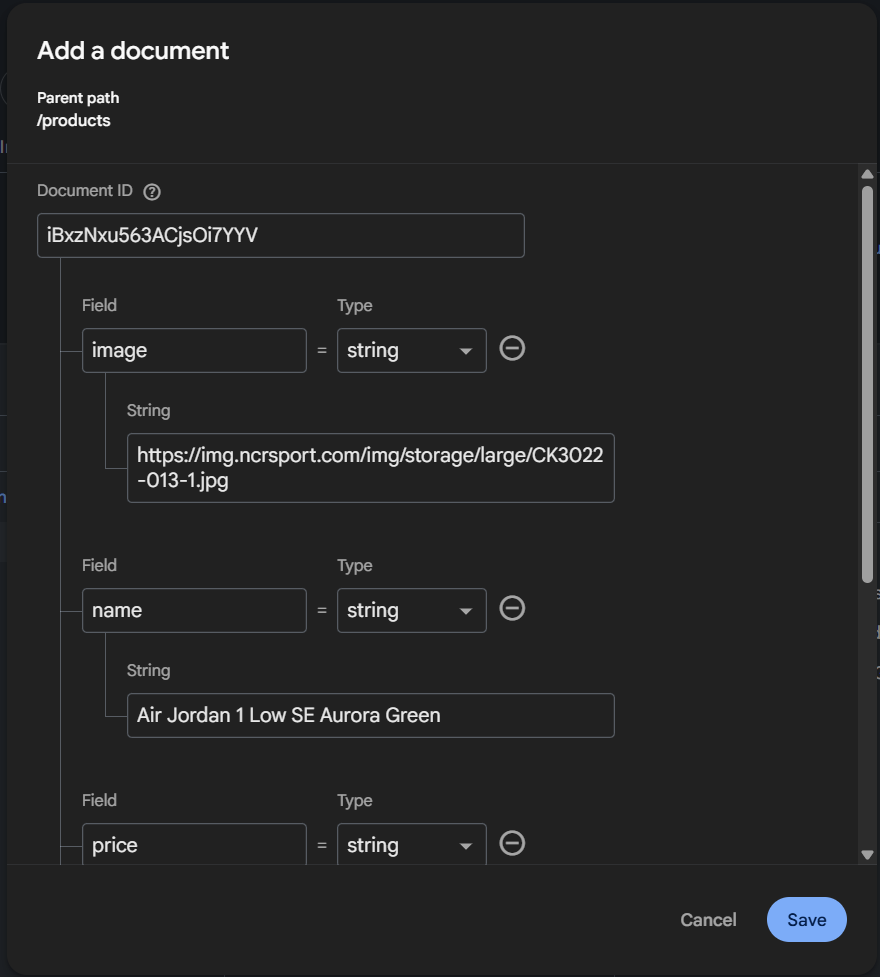

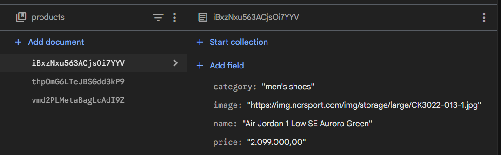

Tampilan Awal: 

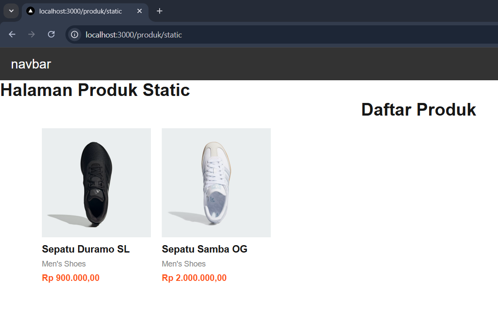

Setelah di Refresh:

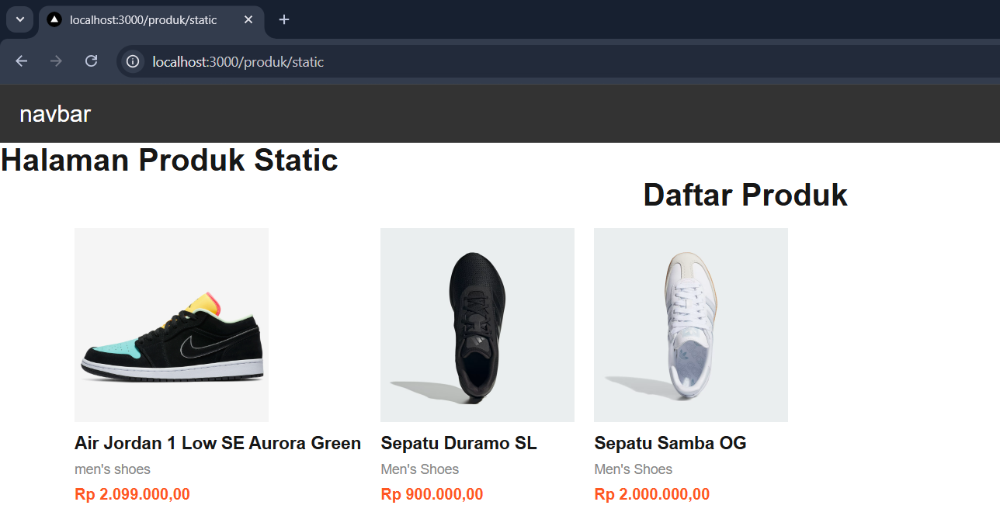

2. Implementasikan ISR dengan revalidate: 10.

3. Tambahkan endpoint On-Demand Revalidation.

4. Tambahkan validasi token.

5. Uji dengan:

o Token benar

o Token salah

o Tanpa token

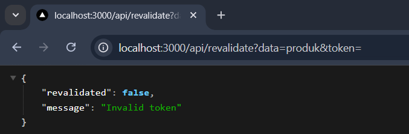

## H. Pertanyaan Analisis

**1. Mengapa ISR lebih fleksibel dibanding SSG?**
ISR (Incremental Static Regeneration) jauh lebih fleksibel karena memungkinkan pembaruan data pada halaman berjenis statis secara *background* tanpa mengharuskan developer melakukan proses *build* ulang (rebuild) secara keseluruhan. Pada SSG murni, jika data di database berubah, data di website tidak akan berubah sampai `npm run build` dieksekusi lagi. 

**2. Apa perbedaan revalidate waktu dan on-demand?**
* **Revalidate Waktu (`revalidate: X`):** Menggunakan interval waktu (dalam detik). Jika ada *request* pengguna yang masuk setelah waktu tersebut terlewati, Next.js akan otomatis memicu proses *fetching* ulang di *background* untuk memperbarui *cache* HTML.
* **On-Demand Revalidation:** Memperbarui *cache* HTML secara instan hanya ketika sebuah *endpoint* API khusus (contoh: `/api/revalidate`) dipanggil secara manual, misalnya setelah CMS ditekan tombol "Publish".

**3. Mengapa endpoint revalidation harus diamankan?**
Endpoint ini melakukan pekerjaan yang memakan sumber daya server (mengambil data dari database dan merender ulang HTML). Jika tidak diamankan dengan *secret token*, siapa saja (termasuk *bot* atau *hacker*) dapat memanggil URL tersebut secara berulang-ulang.

**4. Apa risiko jika token tidak digunakan?**
Risiko terbesarnya adalah serangan *Denial of Service* (DoS). Pelaku bisa membanjiri *endpoint* revalidasi dengan *request*, membuat server terus-menerus melakukan *build* ulang halaman di *background*, yang pada akhirnya membuat CPU server kelebihan beban, menghabiskan kuota pembacaan database (Firebase), dan membuat *website* menjadi lambat atau mati (crash).

**5. Kapan ISR lebih cocok dibanding SSR?**
ISR lebih cocok digunakan pada halaman yang kontennya *semi-dinamis* (diperbarui berkala namun tidak harus *real-time* di detik yang sama untuk setiap *user*) dan memiliki *traffic* baca yang tinggi, seperti halaman artikel blog, katalog produk, atau dokumentasi. ISR memberikan kecepatan *loading* secepat SSG, namun tidak membebani database di setiap *request* seperti yang terjadi pada SSR.