# Middleware & Route Protection

Pemrograman Berbasis Framework

Nama: Danendra Adhipramana

Nim: 244107023011

Prodi: D4 Teknik Informatika

# Documentations

## C. Langkah Praktikum

### Bagian 1 – Membuat Middleware

1. Modifikasi file `index.tsx` pada folder src/pages/produk

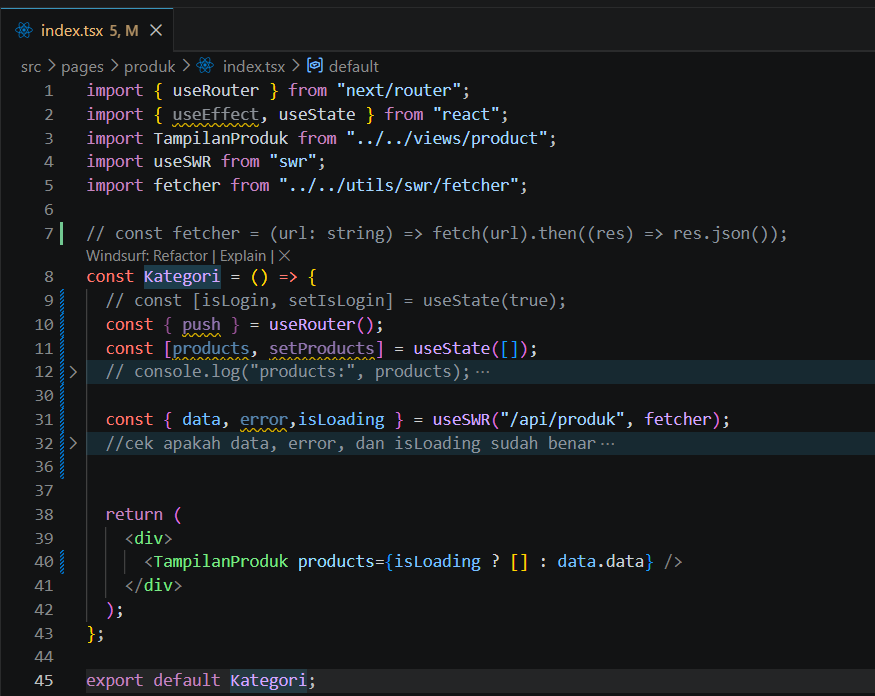

2. Buat file: src/`middleware.ts` Sejajar dengan folder pages.

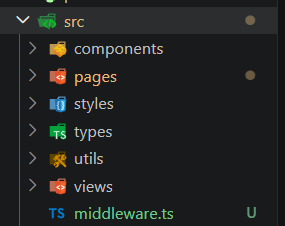

### Bagian 2 – Struktur Dasar Middleware

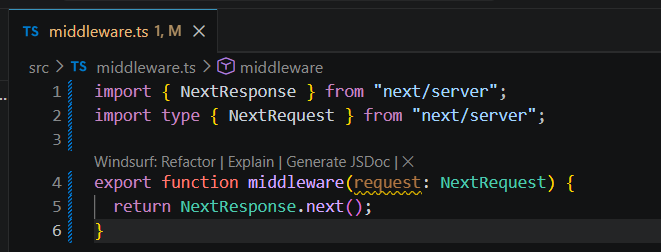

o Jika menggunakan NextResponse.next() → tidak ada redirect.

o Jadi masih bisa mengakses ke http://localhost:3000/produk

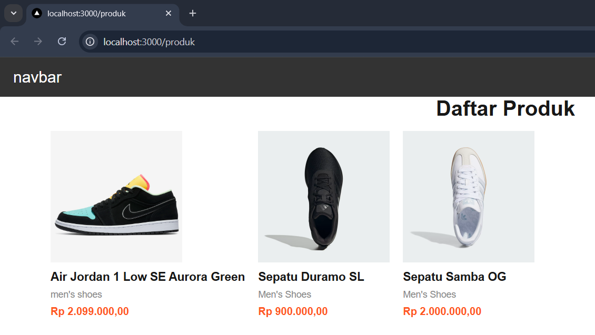

### Bagian 3 – Redirect Sederhana

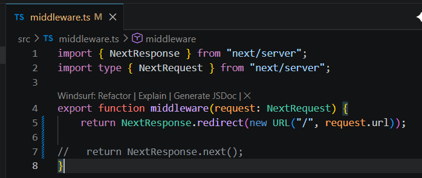

Semua halaman akan redirect ke home dan error dikarenakan terus menerus loading

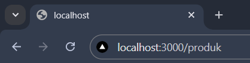

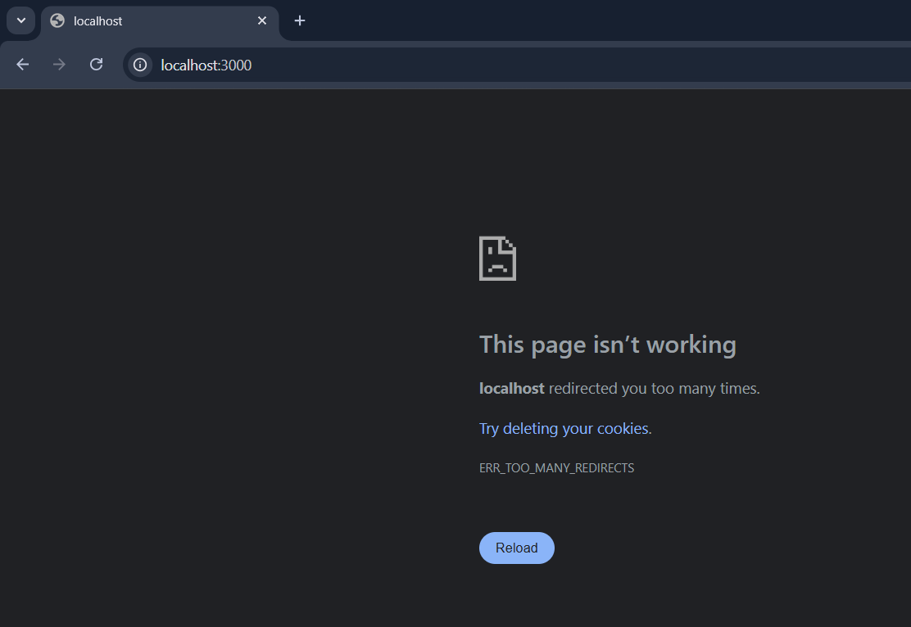

### Bagian 4 – Batasi Route Tertentu

o Untuk mengatasi pada bagian 3 maka perlu pembatasan route

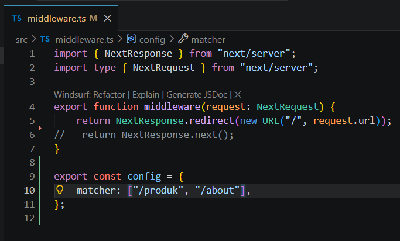

o Artinya:

• Middleware hanya berlaku untuk /products dan /about

• Halaman lain tetap normal

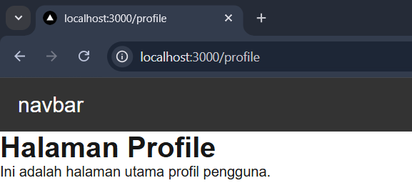

ketika halaman profile tidak redirect

• Ketika user mengakses halaman produk dan about maka akan langsung redirect ke halaman home

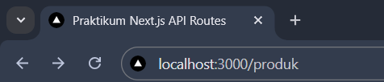

redirect ke home

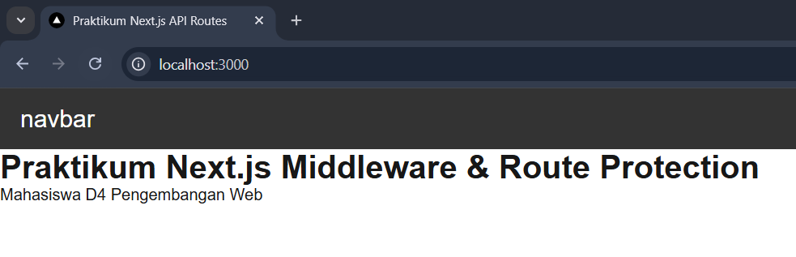

### Bagian 5 – Simulasi Sistem Login

1. Modifikasi file `middleware.ts`

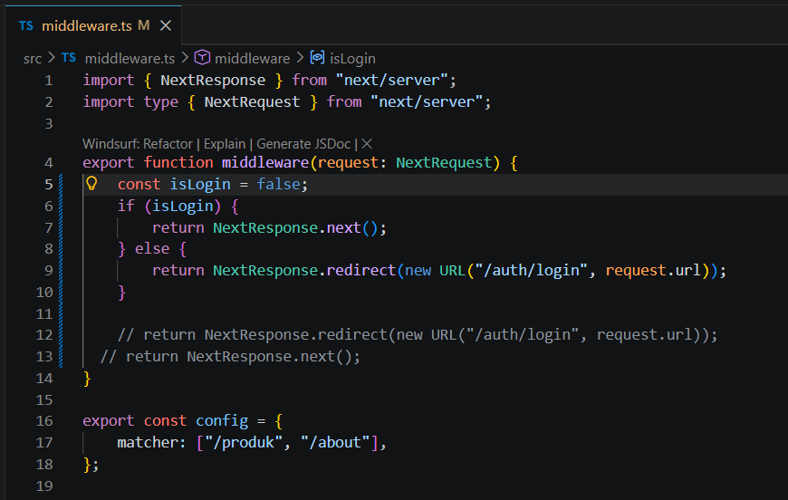

o Jika user langsung mengakses ke alamat http://localhost:3000/produk tidak akan bisa, user akan diarahkan ke halaman login

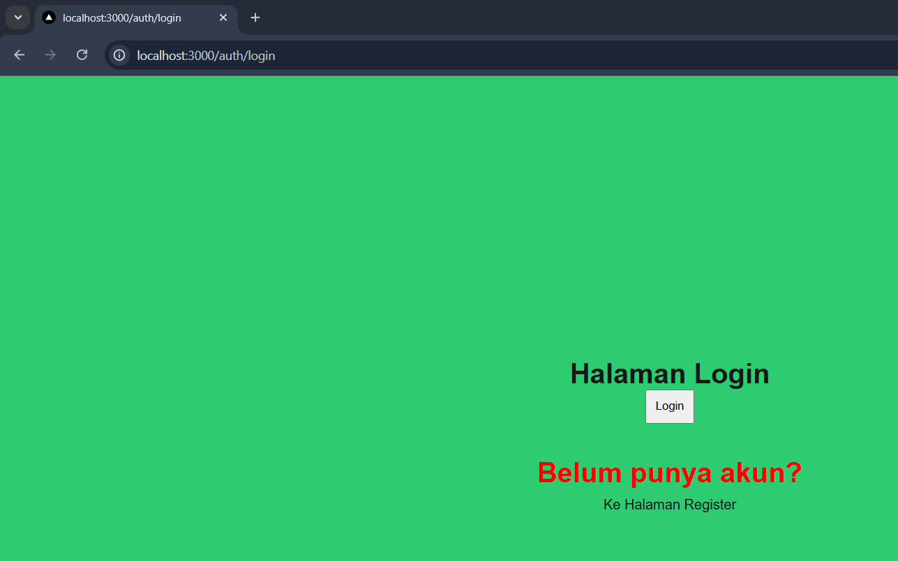

## D. Pengujian

### Uji 1 – isLogin = false
Akses:

/products

Hasil:

Redirect ke /login

### Uji 2 – isLogin = true
Ubah:

const isLogin = true

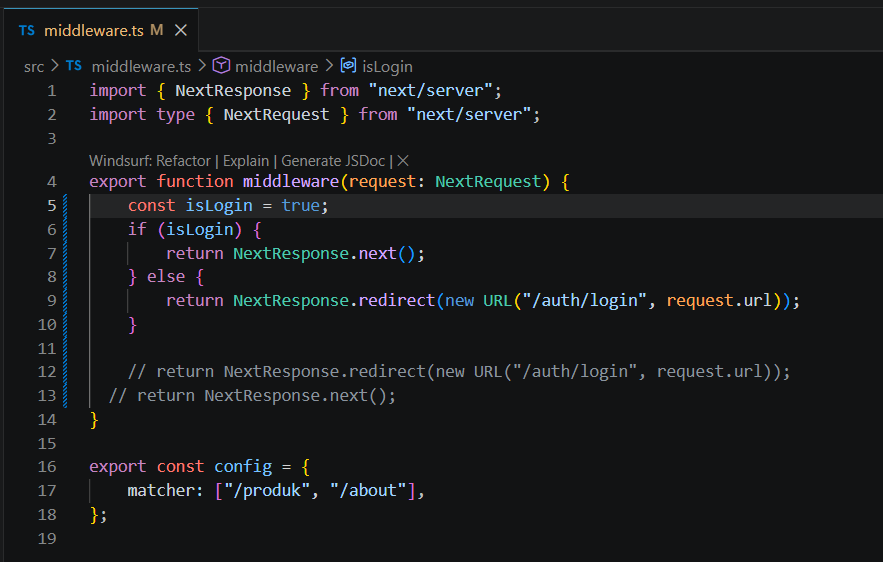

Hasil:

Bisa mengakses /products

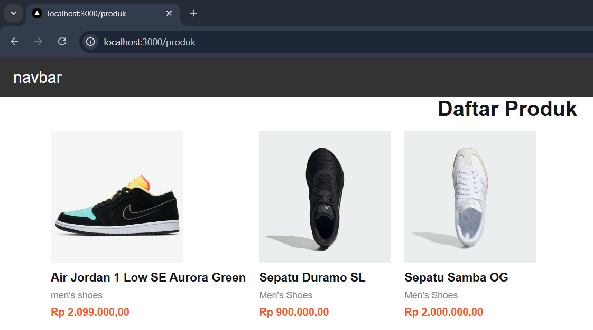

### Uji 3 – Tambahkan Multiple Route

export const config = {

matcher: ['/products', '/about']

}

Sekarang:

• /products dan /about butuh login

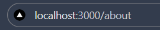

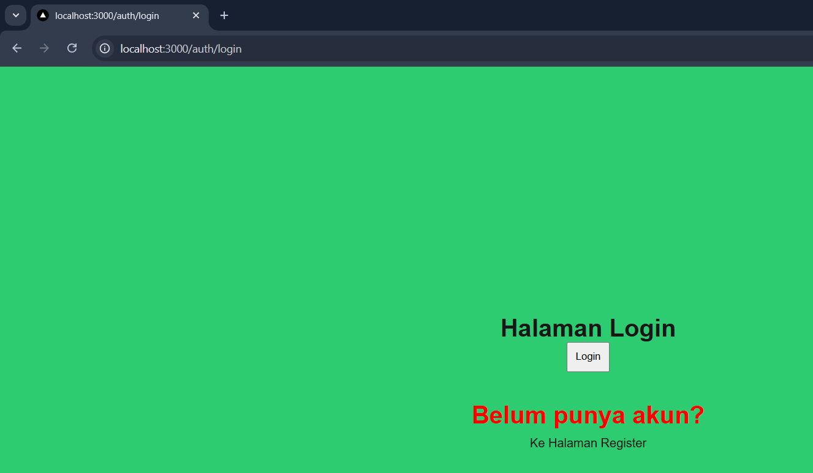

• Halaman lain bebas

## F. Tugas Praktikum

1. Buat halaman:

o /products

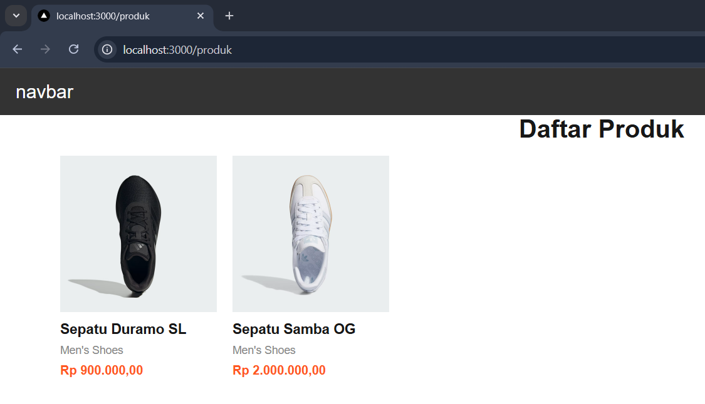

o /about

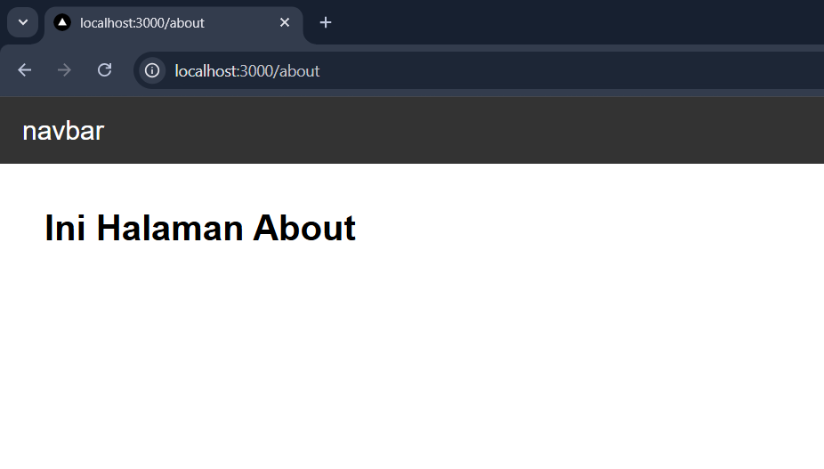

o /login

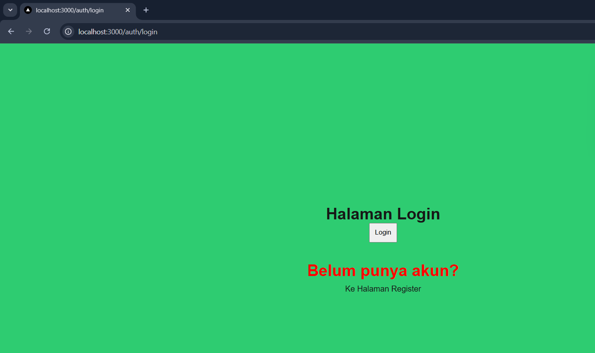

2. Implementasikan Middleware:

o Redirect ke /login jika belum login.

redirect

o Izinkan akses jika login true.

redirect

3. Tambahkan proteksi hanya untuk route tertentu.

• /products dan /about butuh login

4. Dokumentasikan:
o Screenshot sebelum dan sesudah redirect.

sebelum redirect

sesudah redirect

o Perbandingan dengan useEffect.

> Perbandingan dengan useEffect: bahwa saat menggunakan useEffect, halaman rahasia sempat berkedip/terlihat sesaat sebelum pindah ke halaman login. Sedangkan dengan Middleware, halaman langsung diarahkan ke login tanpa menampilkan konten halaman rahasia sama sekali.

## G. Pertanyaan Analisis

**1. Mengapa middleware lebih aman dibanding useEffect?**
Middleware dieksekusi di *server* atau *edge layer* sebelum *request* halaman diproses atau dikirimkan ke *browser* (klien). Ini membuatnya lebih aman karena pengguna tidak bisa memanipulasi *client-side script* (seperti mematikan JavaScript di browser) untuk membobol halaman, berbeda dengan `useEffect` yang perlindungannya mengandalkan eksekusi *script* di sisi *browser* pengguna.

**2. Mengapa middleware tidak menimbulkan glitch?**
Glitch (halaman rahasia yang berkedip muncul sejenak) terjadi pada `useEffect` karena kode pengecekan dijalankan setelah komponen halaman di-*render* pertama kali oleh *browser*. Sebaliknya, Middleware melakukan validasi dan *redirect* sebelum halaman di-*render*. Jika *user* tidak punya akses, *server* langsung memberikan respons *redirect* tanpa pernah mengirimkan HTML halaman tersebut ke *browser*.

**3. Apa risiko jika semua halaman diproteksi tanpa pengecualian?**
Risiko terbesarnya adalah terjadinya *Infinite Redirect Loop* (perulangan pengalihan tanpa akhir) atau *user* terkunci sepenuhnya dari aplikasi. Jika semua halaman diproteksi, ketika *user* yang belum login diarahkan ke halaman `/login`, middleware akan mendeteksi bahwa halaman `/login` tersebut juga diproteksi, sehingga *user* dilempar lagi ke `/login`, dan begitu seterusnya hingga browser memunculkan pesan *error*.

**4. Kapan middleware tidak diperlukan?**
Middleware tidak diperlukan jika sebuah halaman murni bersifat publik (seperti halaman *landing page*, beranda, atau artikel blog publik yang tidak memerlukan otentikasi). Middleware juga mungkin tidak cocok untuk logika bisnis yang sangat rumit dan membutuhkan pengambilan data berat dari *database* (sebaiknya diletakkan di API Routes atau `getServerSideProps`), karena middleware dirancang untuk tereksekusi dengan sangat cepat dan ringan di *Edge Network*.

**5. Apa perbedaan middleware dan API route?**
* **Middleware** adalah penjaga gerbang yang mencegat (intercept) setiap *request* yang masuk sebelum mencapai *route* tujuan. Tugasnya memodifikasi *request/response*, memeriksa *header/cookie*, atau melakukan *redirect*.
* **API Route** adalah *endpoint backend* sesungguhnya yang bertugas memproses data. API Route menerima *request*, berkomunikasi dengan *database* atau layanan pihak ketiga, lalu mengembalikan data berformat JSON kepada klien (Frontend).