# Optimasi Performa Aplikasi Menggunakan Fitur Next.js

Pemrograman Berbasis Framework

Nama: Danendra Adhipramana

Nim: 244107023011

Prodi: D4 Teknik Informatika

# Documentations

## PRAKTIKUM 1 – Image Optimization

### A. Optimasi Gambar Lokal (Public Folder)

* Mengganti tag  pada halaman 404 dengan next/image. Langkah:

* Buka file src/pages/404.tsx

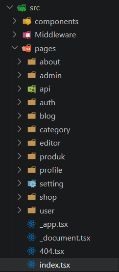

* Modifikasi line 7 menjadi line 8-11

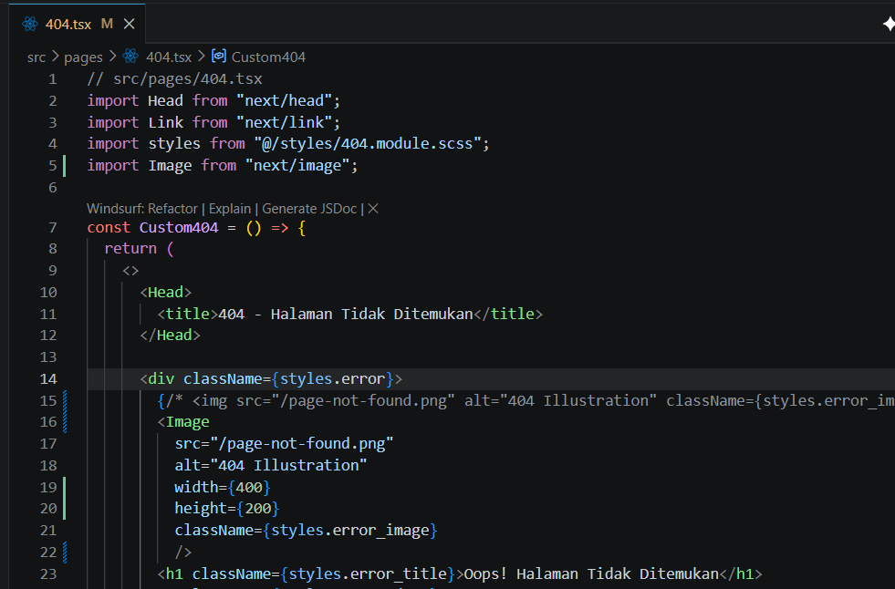

Hasil:

• Warning hilang

• Image dioptimasi otomatis

• Mengurangi bandwidth

• Mendukung lazy loading otomatis

### B. Optimasi Gambar Remote (External URL)

o Buka file views/product/index.tsx

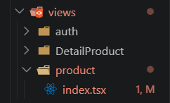

o Modifikasi file index.tsx

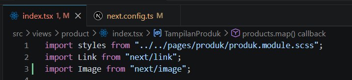

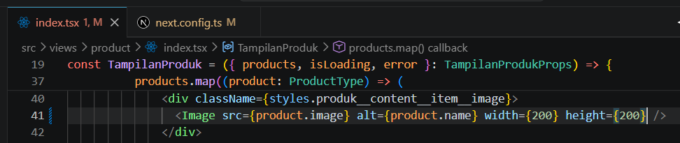

o Buka file next.config.js

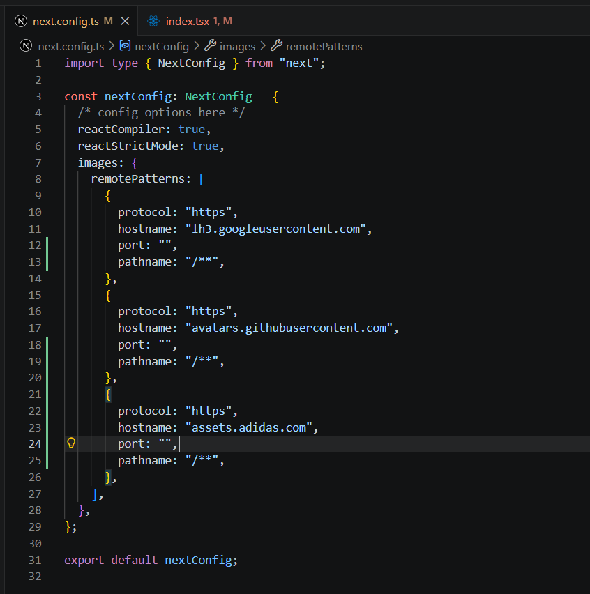

Hasil:

• Gambar di-proxy melalui /_next/image

• Performa lebih optimal

• Kompresi otomatis

## PRAKTIKUM 2 – Font Optimization

A. Menggunakan next/font

o Buka file index.tsx pada folder Appshell/index.tsx dan modifkasi

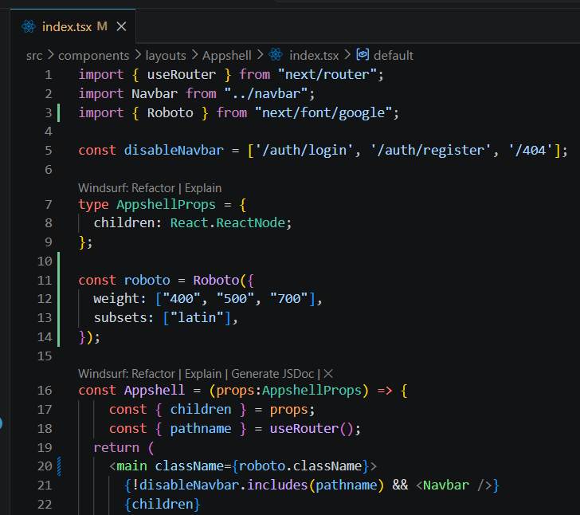

o Jalankan browser localhost:3000/produk maka font akan berubah menjadi roboto

untuk mengecek fontnya bisa menggunakan extension FontFinder

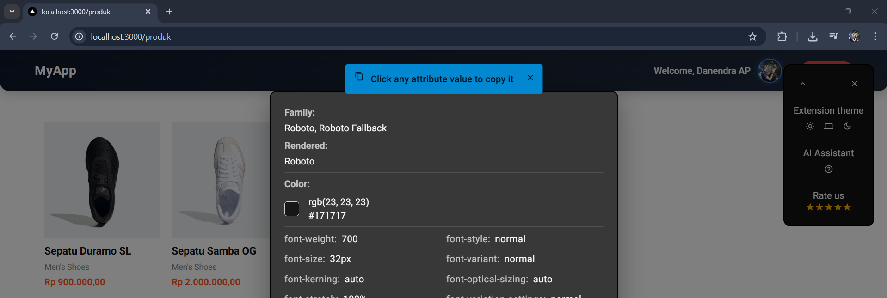

Hasil:

• Tidak perlu load dari CDN manual

• Tidak blocking render

• Performance meningkat

• Tidak terjadi FOUT (Flash of Unstyled Text)

## PRAKTIKUM 3 – Script Optimization

B. Menggunakan next/script

o Buka file index.tsx pada folder layouts/Navbar dan modifikasi

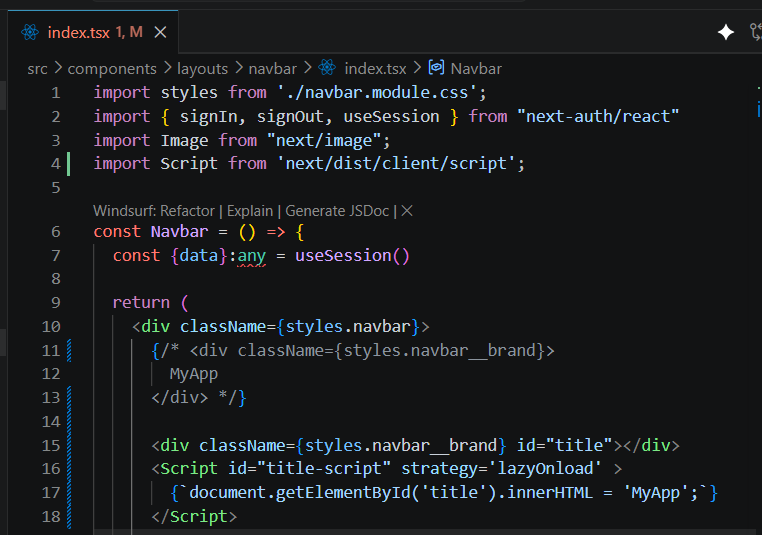

o Pada kasus diatas kita merubah line 11 menggunakan model Typescript dapat terlihat ketika kita refresh web produk tulisan myApp akan terlihat berkedip

o Perbedaan mendasar antara Line 11-13 dan Line 15-18 pada file index.tsx Anda terletak pada metode rendering teks dan interaksi dengan DOM (Document Object Model). Berikut adalah rincian perbedaannya:

I. Metode Rendering

a. Line 11-13 (Standard React/JSX): Ini adalah cara standar React. Teks "MyApp" ditulis langsung di dalam tag div. React akan langsung merender teks ini ke dalam HTML saat komponen
dimuat.

b. Line 15-18 (Next.js Script & Manual DOM): Menggunakan
komponen `<Script>` dari Next.js dengan strategi lazyOnload. Teks tidak ada di dalam HTML saat awal dimuat, melainkan baru
"disuntikkan" secara manual menggunakan perintah JavaScript
document.getElementById('title').innerHTML = 'MyApp'; setelah
script tersebut diunduh di latar belakang.

II. Performa dan SEO

a. Line 11-13: Sangat baik untuk SEO karena teks "MyApp" langsung terbaca oleh robot pencari (crawler) dalam kode sumber HTML.

b. Line 15-18: Kurang baik untuk SEO untuk konten penting karena teks baru muncul setelah JavaScript dijalankan. Strategi lazyOnload berarti script ini dijalankan paling akhir setelah semua sumber daya utama selesai dimuat, sehingga mungkin ada jeda waktu (delay) sebelum teks muncul di layar.

III. Keamanan (XSS)

a. Line 11-13: Aman karena React secara otomatis melakukan escape pada string untuk mencegah serangan Cross-Site Scripting (XSS).

b. Line 15-18: Memiliki risiko keamanan lebih tinggi karena
menggunakan .innerHTML. Jika data yang dimasukkan berasal dari
input user, ini bisa dimanfaatkan untuk menyuntikkan skrip
berbahaya.

Hasil:

• Script tidak blocking

• Cocok untuk Google Analytics

• Performa lebih ringan

## PRAKTIKUM 4 – Optimasi Avatar dengan next/image

o Buka file index.tsx pada folder layouts/navbar dan modifikasi :

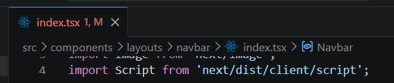

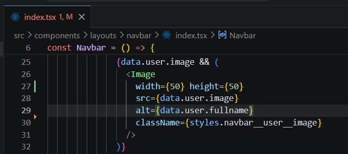

o Tambahkan hostname Google:

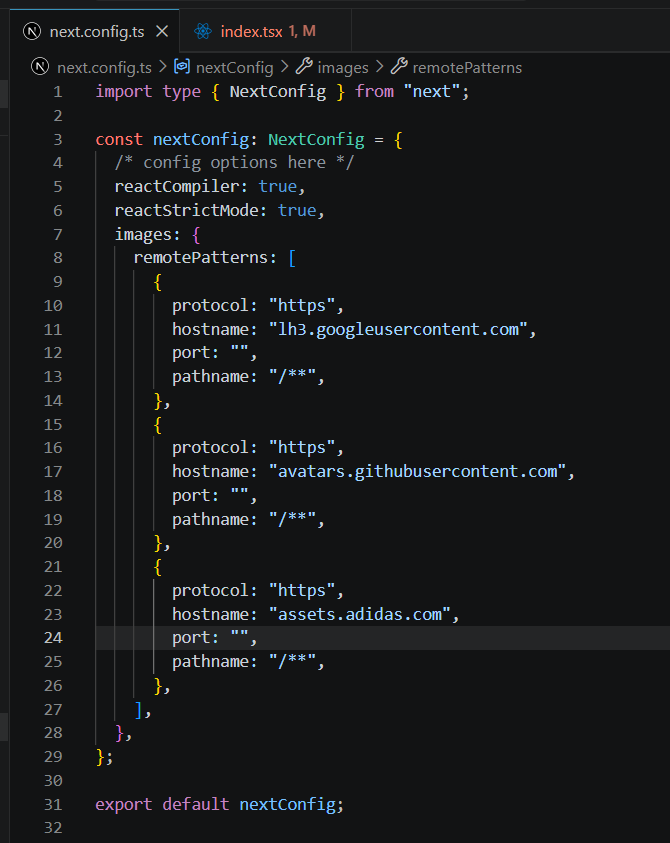

## Tugas Praktikum

1. Optimasi semua image di project menggunakan next/image

2. Gunakan minimal 1 font dari next/font

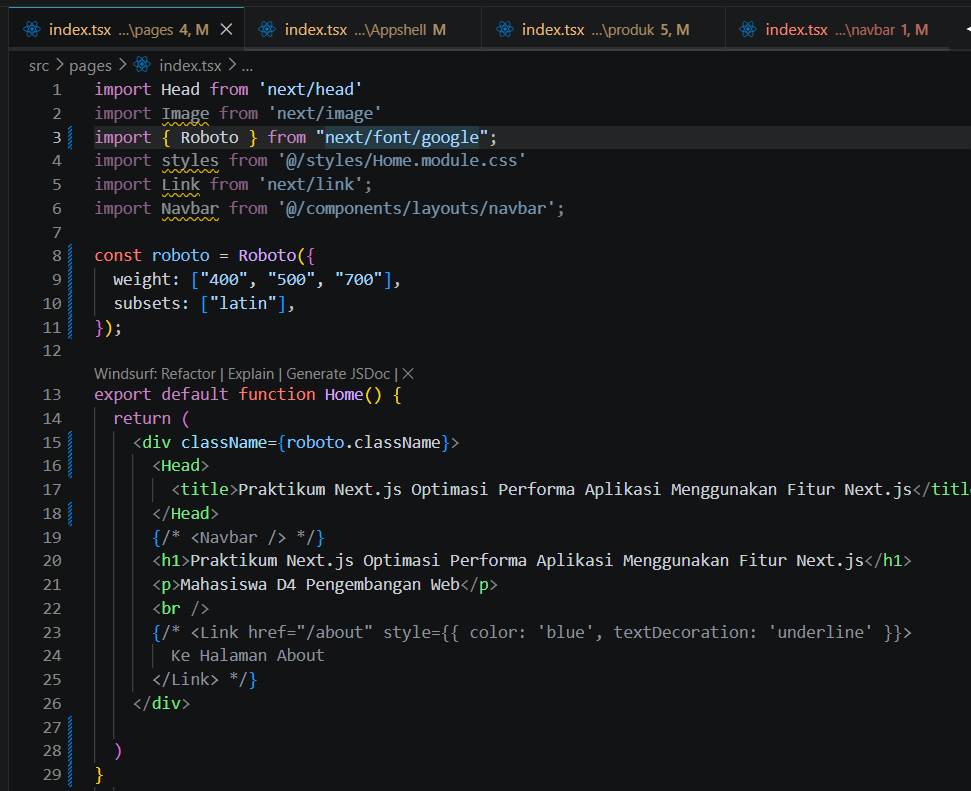

3. Tambahkan script Google Analytics menggunakan next/script

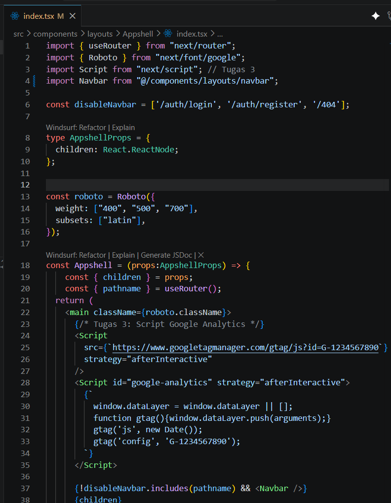

4. Terapkan dynamic import pada minimal 1 komponen

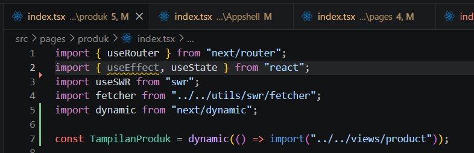

5. Dokumentasikan perubahan performa (screenshot Lighthouse)

Sebelum:

http://localhost:3000/

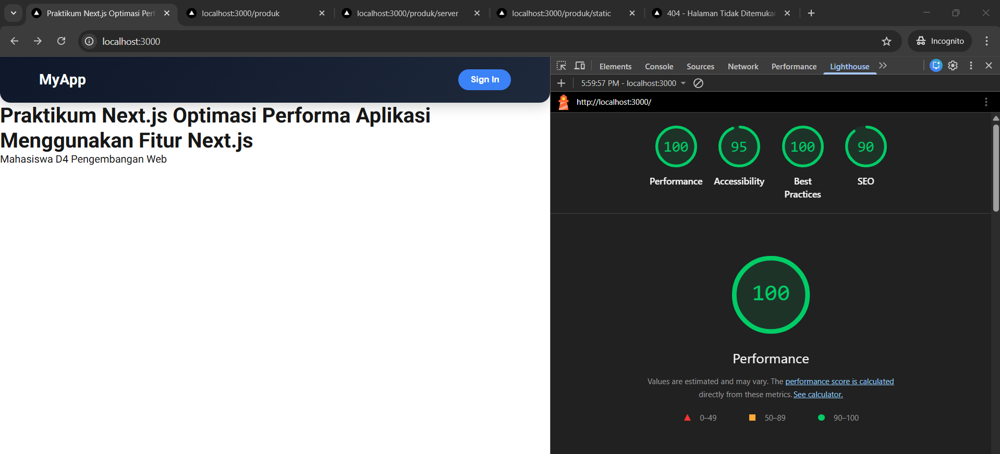

http://localhost:3000/produk

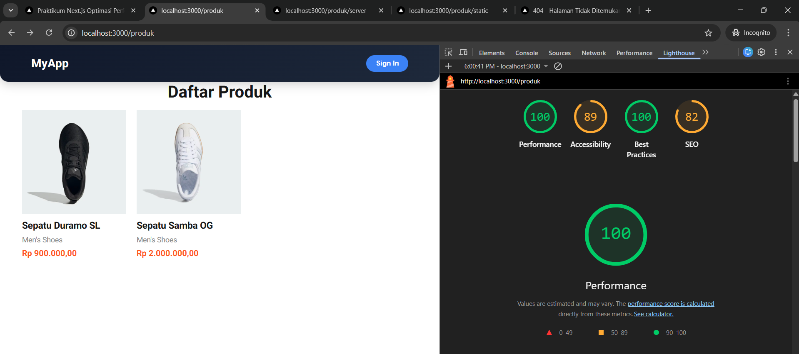

http://localhost:3000/produk/server

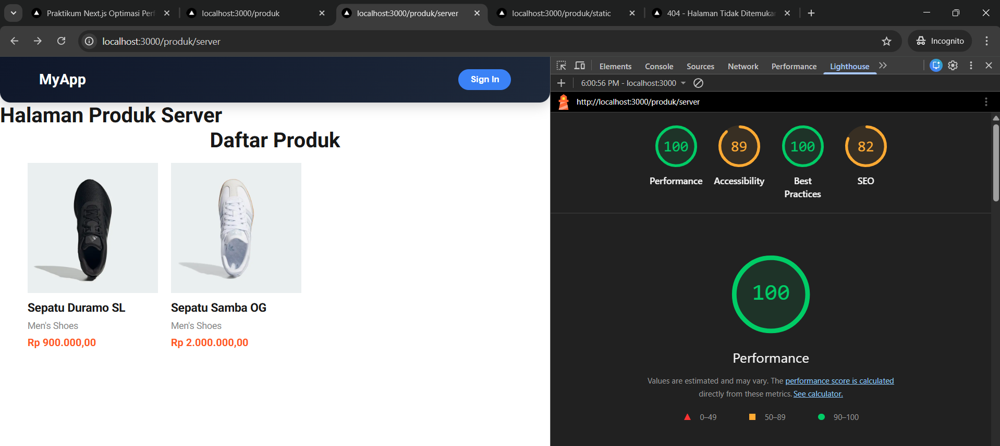

http://localhost:3000/produk/static

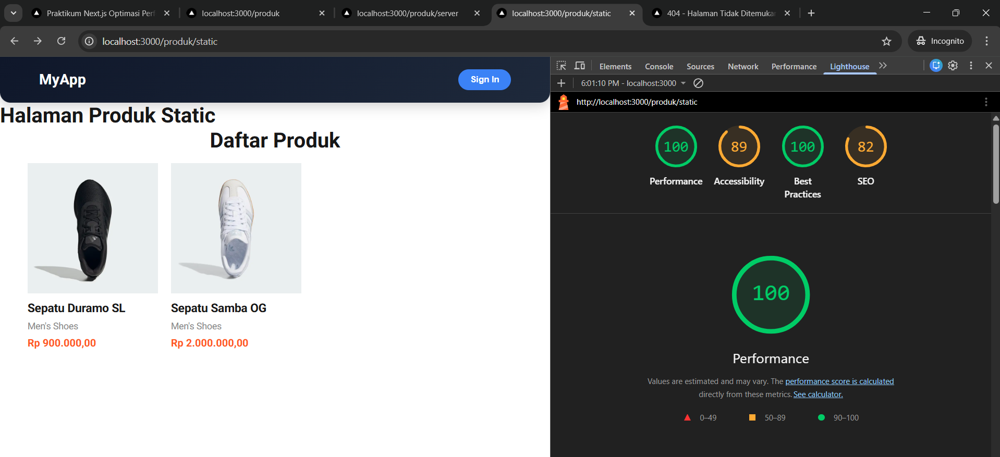

http://localhost:3000/404

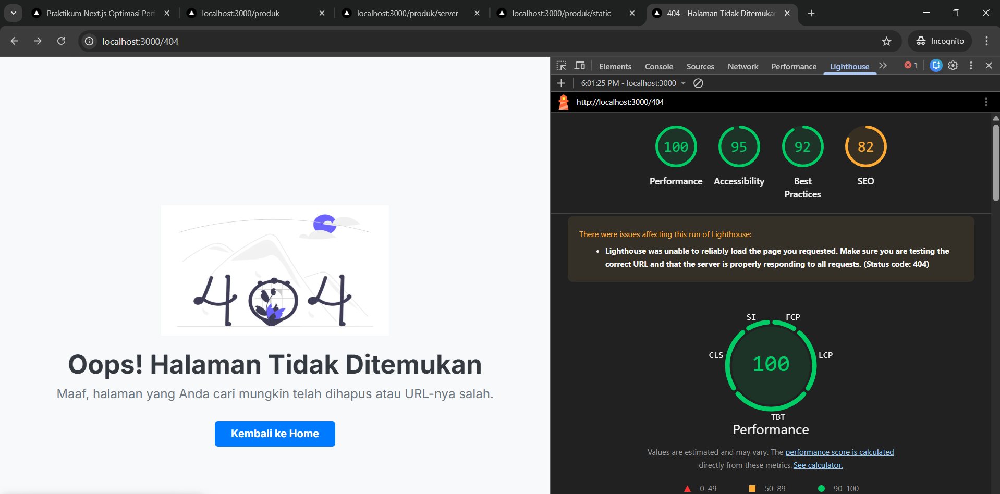

Sesudah:

http://localhost:3000/

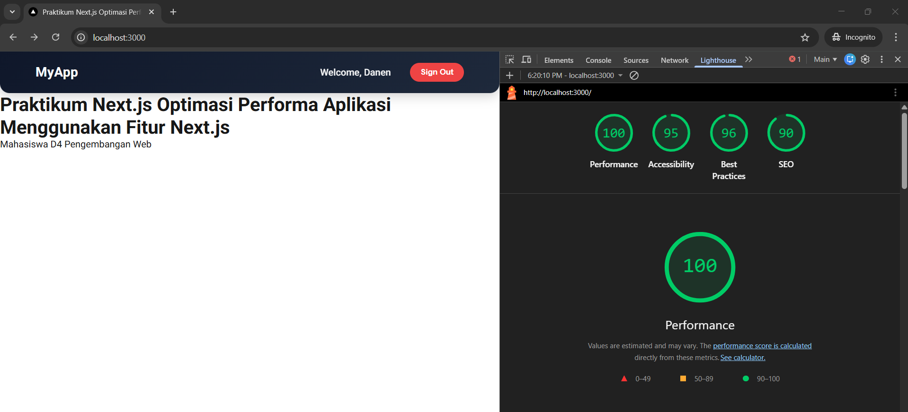

http://localhost:3000/produk

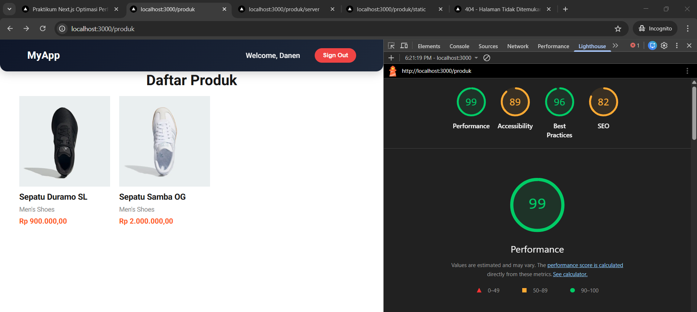

http://localhost:3000/produk/server

http://localhost:3000/produk/static

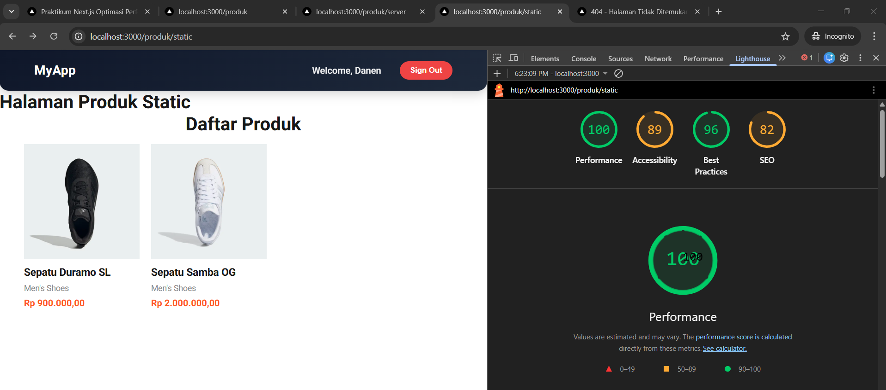

http://localhost:3000/404

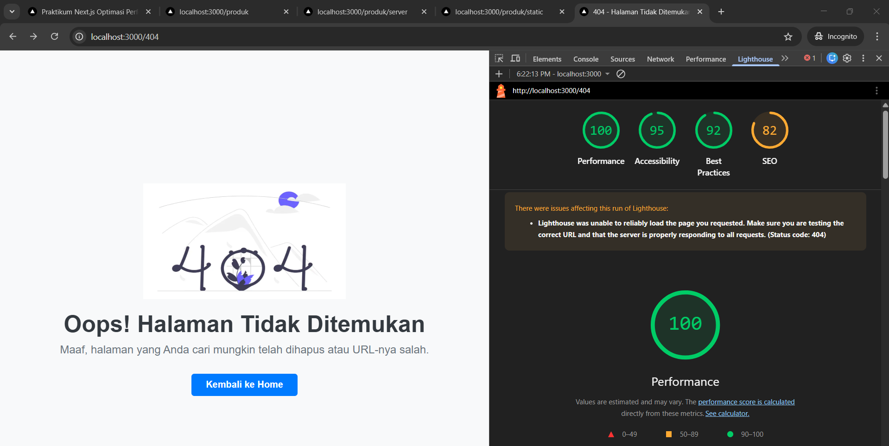

## Refleksi & Diskusi

**1. Mengapa `` biasa tidak optimal?**
Tag `` HTML bawaan tidak memiliki optimasi performa otomatis. Gambar akan diunduh sesuai ukuran aslinya yang mungkin sangat besar, tidak menggunakan format modern seperti WebP/AVIF, dan tidak memiliki fitur *lazy loading* bawaan yang cerdas. Hal ini menghabiskan *bandwidth* dan menyebabkan perubahan tata letak halaman yang mengganggu (Cumulative Layout Shift / CLS) saat gambar akhirnya selesai dimuat. Sedangkan komponen `next/image` menangani semua masalah ini secara otomatis.

**2. Apa perbedaan font CDN dan next/font?**
Saat menggunakan font dari CDN (seperti Google Fonts via tag `<link>`), *browser* harus membuat koneksi jaringan ekstra ke *server* eksternal untuk mengunduh *file* font. Ini memicu *delay* dan fenomena teks berkedip (FOIT/FOUT). Sementara itu, `next/font` mengunduh *file* font secara otomatis saat proses *build time* dan menyimpannya secara lokal bersama aset statis aplikasimu. Ini menghilangkan kebutuhan *request* ke jaringan eksternal dan secara otomatis mencegah pergeseran tata letak (CLS).

**3. Mengapa script bisa membuat website lambat?**
Secara bawaan, script JavaScript bersifat *render-blocking*. Artinya, ketika *browser* sedang membaca HTML dan tiba-tiba menemukan tag `<script>` eksternal, *browser* akan menghentikan sementara proses *rendering* UI halaman untuk mengunduh dan mengeksekusi script tersebut. Jika script-nya berat (seperti analitik atau iklan), pengguna hanya akan melihat layar putih untuk waktu yang lama.

**4. Kapan harus menggunakan dynamic import?**
*Dynamic import* sebaiknya digunakan ketika aplikasi memiliki komponen yang sangat besar (berat) namun tidak langsung dibutuhkan oleh pengguna saat halaman pertama kali dibuka (*initial load*). Contohnya adalah komponen *modal popup* yang hanya muncul saat tombol diklik, komponen grafik interaktif yang ada di bagian bawah halaman (*below the fold*), atau modul *Rich Text Editor*.

**5. Apa dampak bundle size terhadap UX?**
*Bundle size* (ukuran total *file* JavaScript hasil *build*) yang terlalu besar akan sangat memperburuk *User Experience* (UX). Semakin besar *bundle*-nya, semakin lama waktu yang dibutuhkan *browser* untuk mengunduh, mengurai, dan mengeksekusi *file* tersebut. Dampak nyatanya adalah metrik *Time to Interactive* (TTI) menjadi sangat lambat. Pengguna mungkin sudah bisa melihat antarmuka (UI), tetapi saat mereka mencoba mengklik tombol atau berinteraksi, halaman tersebut terasa *freeze* atau tidak merespons.
