# Routing, Nested Routing, Dynamic Routing, dan Layouting pada Next.js (Pages Router)

Pemrograman Berbasis Framework

Nama: Danendra Adhipramana

Nim: 244107023011

Prodi: D4 Teknik Informatika

# Documentations

## D. Langkah Praktikum

### 1. Routing Dasar (Static Routing)
a. Menambahkan Halaman About

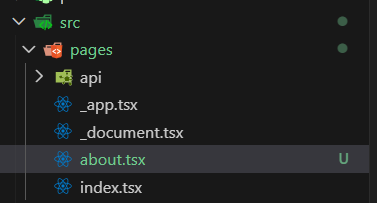

b. Kode

c. Hasil

### 2. Routing Menggunakan Folder
a. Rapikan Struktur Pages

b. hasil

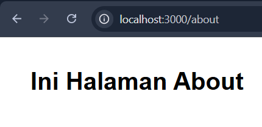

### 3. Nested Routing
a. Buat Folder Setting

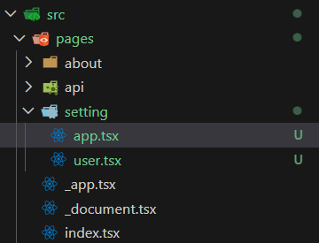

modifikasi kode:

`app.tsx`

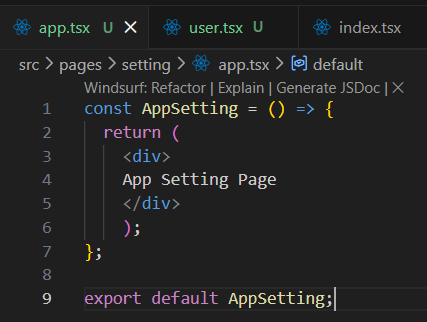

`user.tsx`

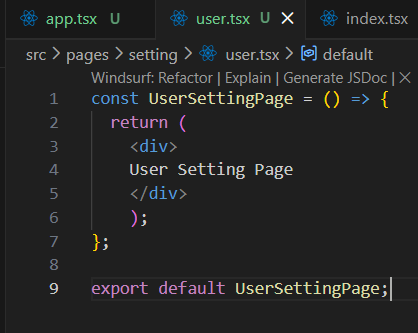

Akses di Browser:

Hasil `user.tsx`

Hasil `app.tsx`

Modifikasi struktur folder pages dengan menambahkan folder user dan user.tsx pada setting
dipindah ke folder user dan rubah file user.tsx menjadi index.tsx

Hasil

b. Nested Lebih Dalam
Struktur Folder

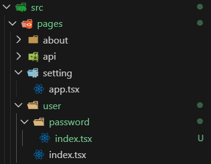

Kode:

Hasil:

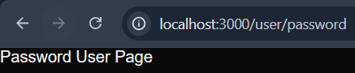

### 4. Dynamic Routing
a. Buat Halaman Produk

Kode `index.tsx`

Hasil `app.tsx`

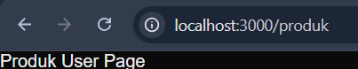

Modifikasi `[id].tsx`

Buka browser http://localhost:3000/produk/sepatu tambahkan segment sepatu

Cek menggunakan Console Log dengan console ninja

Modifikasi [id].tsx agar dapat mengambil nilai dari id

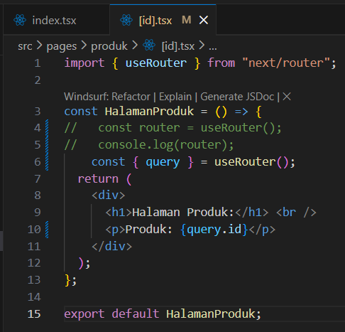

Hasil

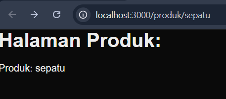

### 5. Membuat Komponen Navbar
a. Struktur Komponen

Modifikasi `global.css`

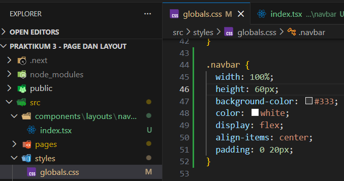

Modifikasi `index.tsx` dengan menambahkan classname untuk style navbar

Modifikasi `index.tsx` pada folder pages

Hasil

Modifikasi navbar agar tampil di semua page

Modifikasi _app.tsx ( Menambahkan navbar )

Hasil

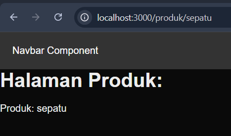

### 6. Membuat Layout Global (App Shell)
a. Buat AppShell

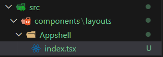

Modifikasi `index.tsx` pad AppShell

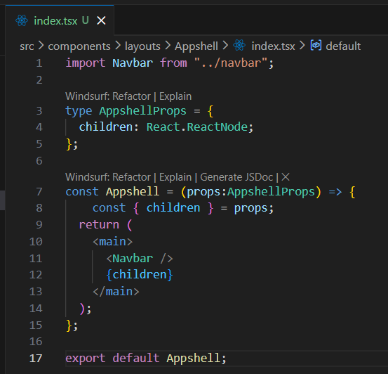

### 7. Implementasi Layout di _app.tsx

Kode `app.tsx`

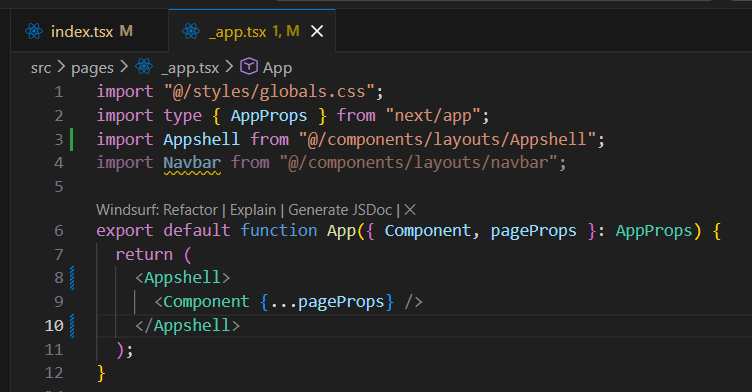

Modifikasi pada _app.tsx tambahkan footer

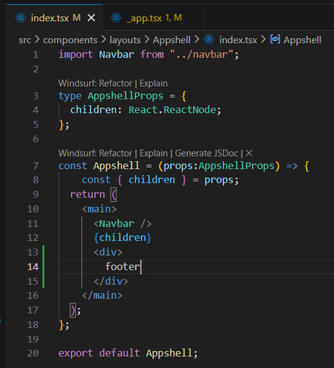

Hasil

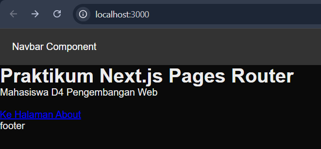

## Tugas Praktikum

### Tugas 1 – Routing
1. Buat halaman:

o /profile

o /profile/edit

Struktur Folder

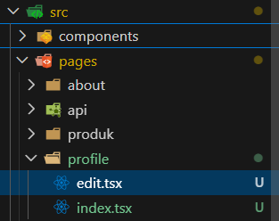

Kode `index.tsx`

Kode `edit.tsx`

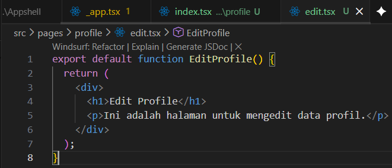

Hasil `/profile`

Hasil `/profile/edit`

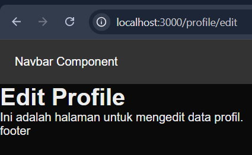

### Tugas 2 – Dynamic Routing
1. Buat routing:
2. /blog/[slug]
3. Tampilkan nilai slug di halaman

Struktur Folder

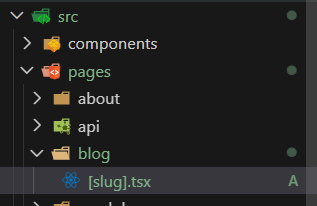

Kode `[slug].tsx`

Hasil

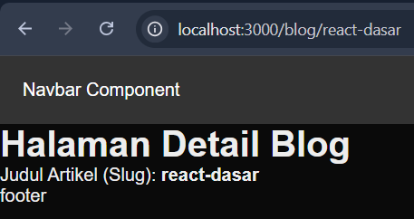

### Tugas 3 – Layout
1. Tambahkan Footer pada AppShell
2. Footer tampil di semua halaman

Kode `index.tsx` pada ``_app.tsx``

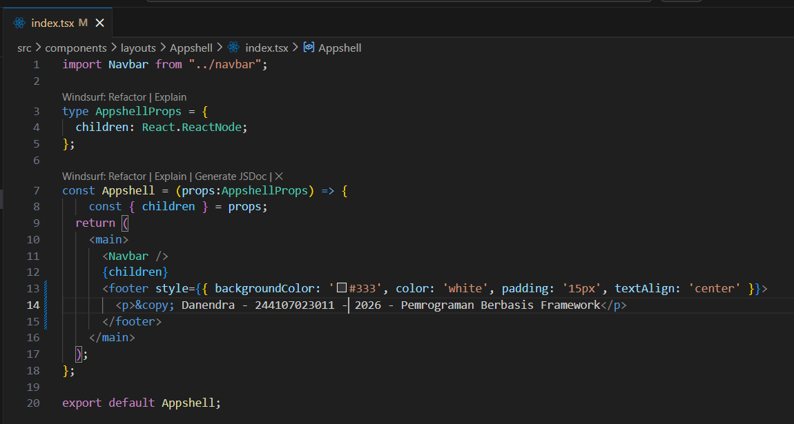

Hasil

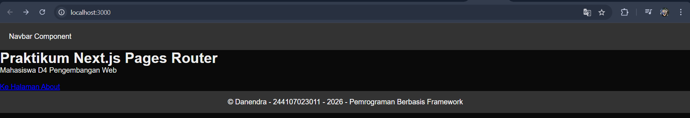

## Pertanyaan Refleksi

1. Apa perbedaan routing berbasis file dan routing manual?

> Routing berbasis file (Next.js): Routing otomatis dibuat berdasarkan struktur folder dan nama file di dalam direktori pages/ tanpa memerlukan konfigurasi tambahan.

>Routing manual (seperti React Router standar): Developer harus menulis kode konfigurasi secara eksplisit untuk memetakan setiap alamat URL ke komponen tertentu.

2. Mengapa dynamic routing penting dalam aplikasi web?

> Dynamic routing memungkinkan kita membuat satu buah template halaman yang bisa menampilkan data berbeda-beda berdasarkan parameter yang ada di URL. Misalnya, daripada membuat ratusan file untuk ratusan artikel blog yang berbeda, kita cukup membuat satu file [slug].tsx yang menangani semua artikel tersebut secara dinamis.

3. Apa keuntungan menggunakan layout global dibanding memanggil komponen satu per satu?

> Keuntungan utamanya adalah efisiensi dan konsistensi. Komponen seperti Navbar dan Footer akan otomatis muncul di semua halaman tanpa perlu kita import dan panggil satu per satu di setiap file halaman. Jika ada perubahan pada desain Navbar, kita hanya perlu mengubahnya di satu tempat (AppShell), dan perubahannya akan langsung teraplikasi ke seluruh aplikasi.