# Custom Document dan Custom Error Page pada Next.js

Pemrograman Berbasis Framework

Nama: Danendra Adhipramana

Nim: 244107023011

Prodi: D4 Teknik Informatika

# Documentations

## D. Langkah Kerja Praktikum

### Langkah 1 – Menjalankan Project

Uninstall package Tailwind

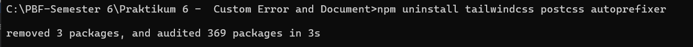

 Hapus file config Tailwind
1. tailwind.config.js
2. postcss.config.js

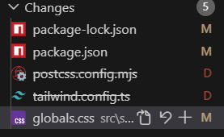

• Jalankan browser 

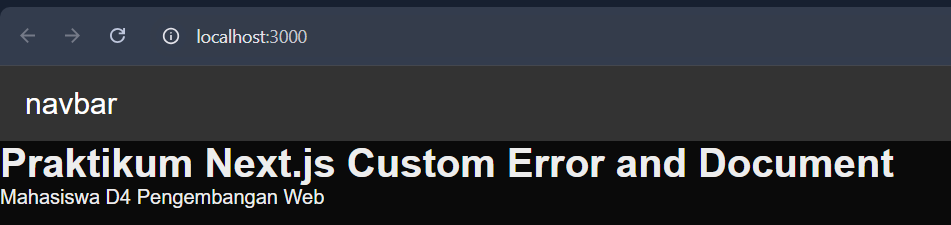

### Langkah 2 – Membuat Custom Document

• Modifikasi pada folder pages `_document.tsx`

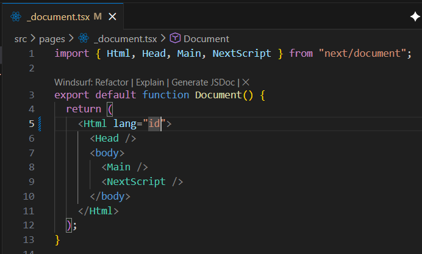

• Periksa di Inspect Element bahwa atribut lang="id" sudah berubah.

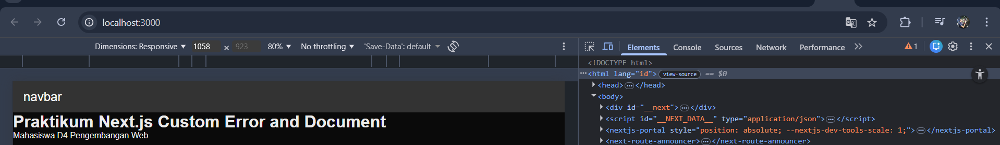

### Langkah 3 – Pengaturan Title per Halaman

• Modifikasi pada folder pages `index.tsx`

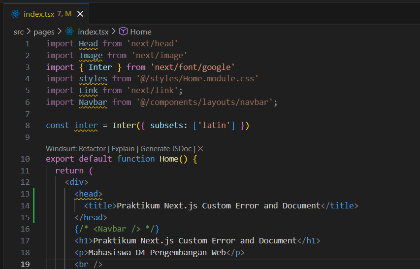

• Refresh halaman dan perhatikan judul tab browser.

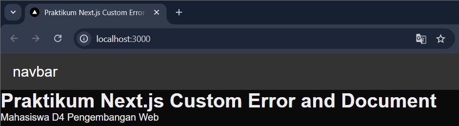

### Langkah 4 – Membuat Custom Error Page (404)

• Di folder pages, buat file `404.tsx`

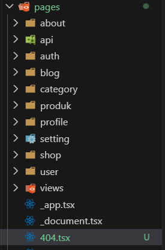

• Isi kode:

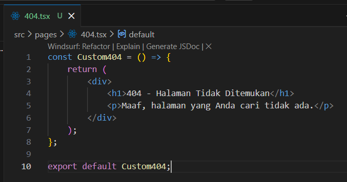

• Akses URL yang tidak ada, misalnya: `/dashboard`

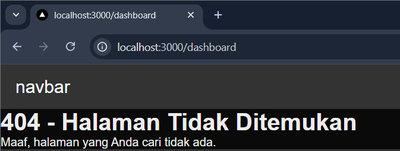

### Langkah 5 – Styling Halaman 404

• Buat file pada folder styles `404.module.scss`

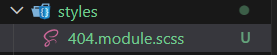

• Tambahkan style:

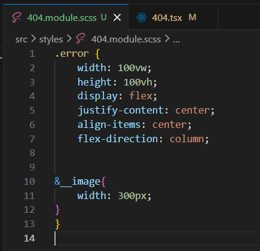

• Modifikasi kode pada folder pages `404.tsx`

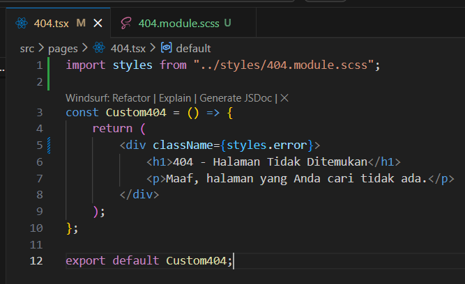

• Jalankan browser

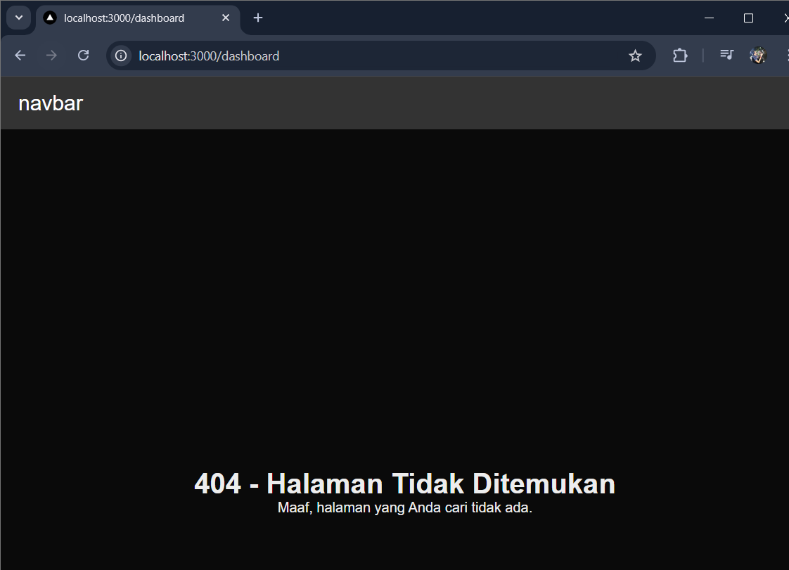

• Jika dijalankan masih ada navbarnya, untuk itu lakukan Handling Navbar di Halaman
404

• Tambahkan ’/404’ pada disable navbar di folder components/layout/appshell/`index.tsx`

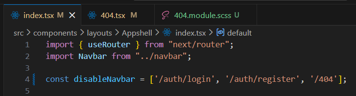

• Jalankan browser

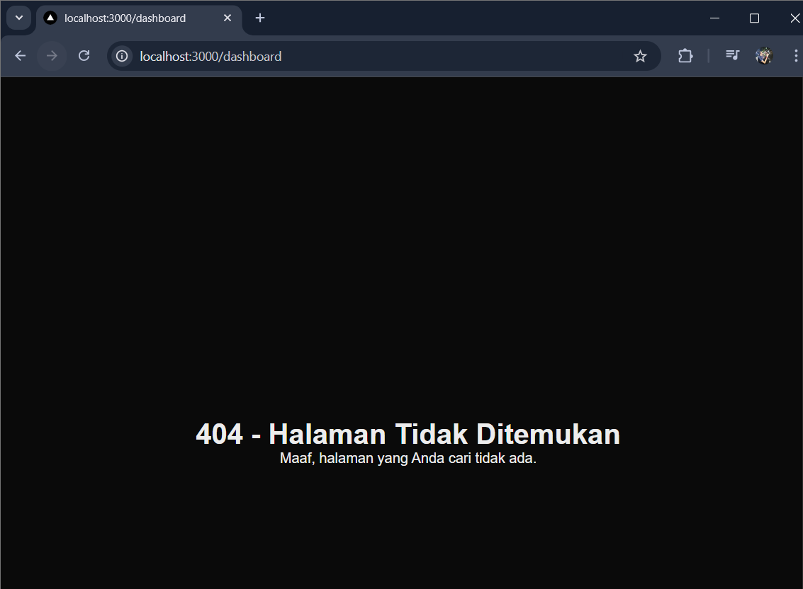

### Langkah 6 – Menampilkan Gambar dari Folder Public

• Buka website https://undraw.co/ download png 404

• Cari 404 dan download png

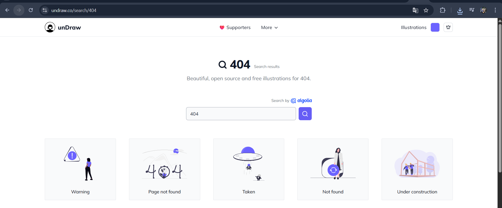

• Simpan gambar not-found.png ke folder public/ dan rename agar memudahkan

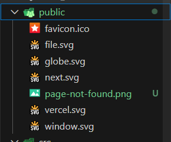

• Modifikasi kode pada `404.tsx`:

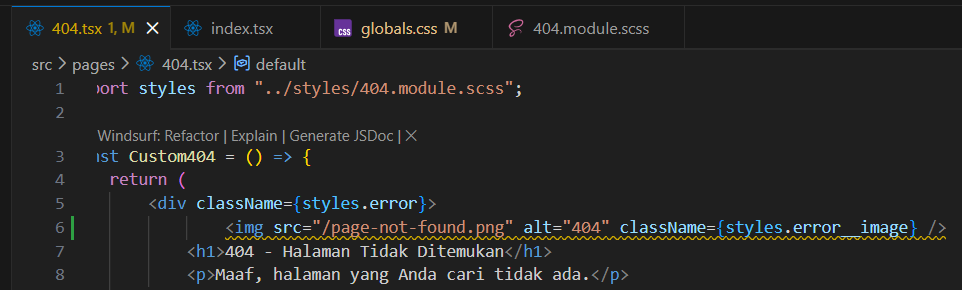

• Jalankan browser

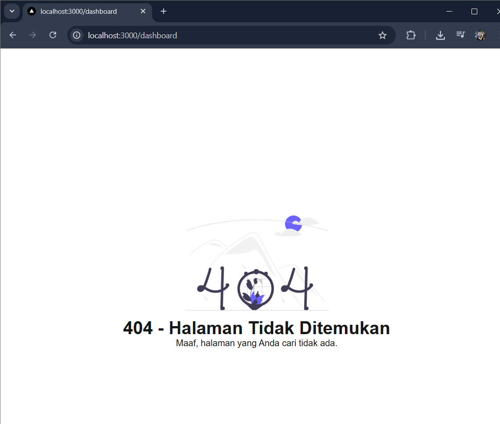

## E. Tugas Praktikum

### Tugas 1 (Wajib)

• Tambahkan:

o Judul halaman

o Deskripsi singkat

o Gambar ilustrasi

isi kode `404.tsx`

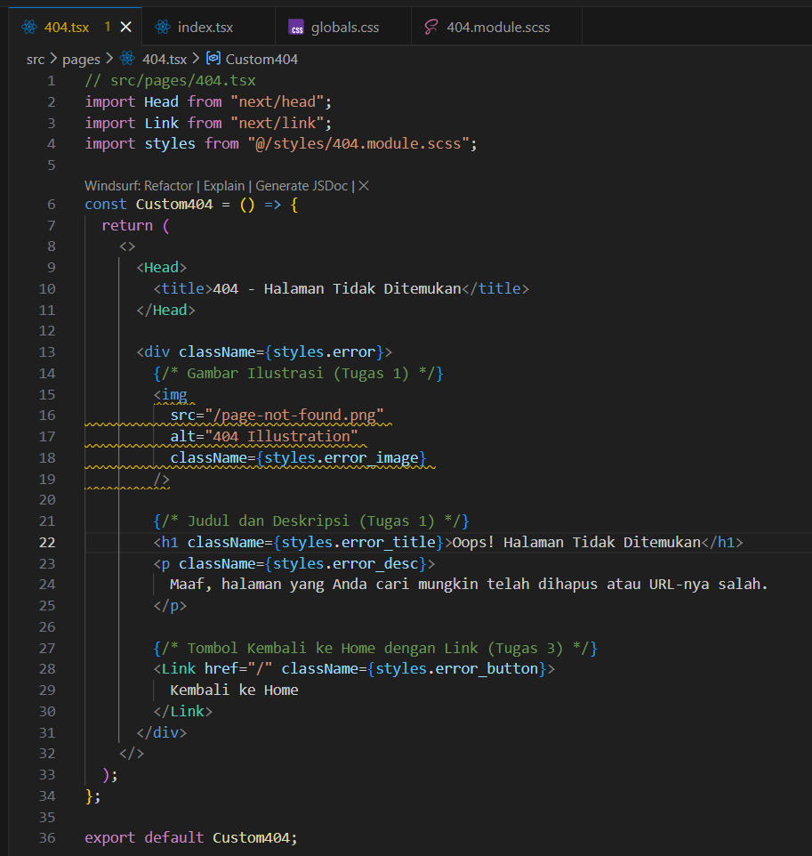

hasil

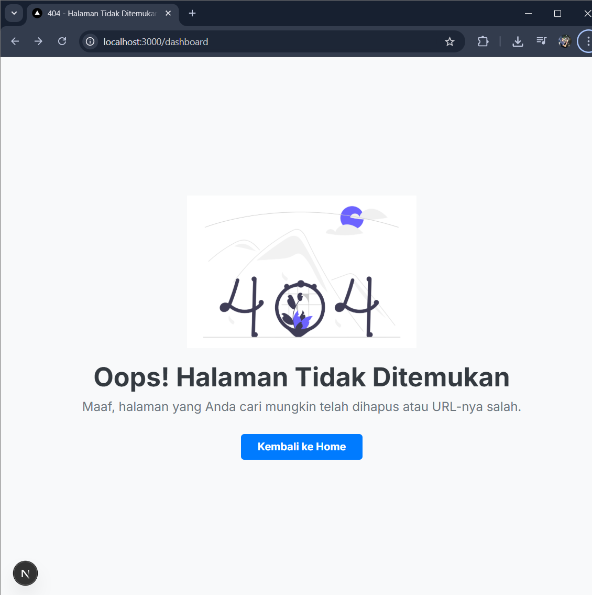

### Tugas 2 (Wajib)

• Custom warna, font, dan layout halaman 404

isi kode `404.module.scss`

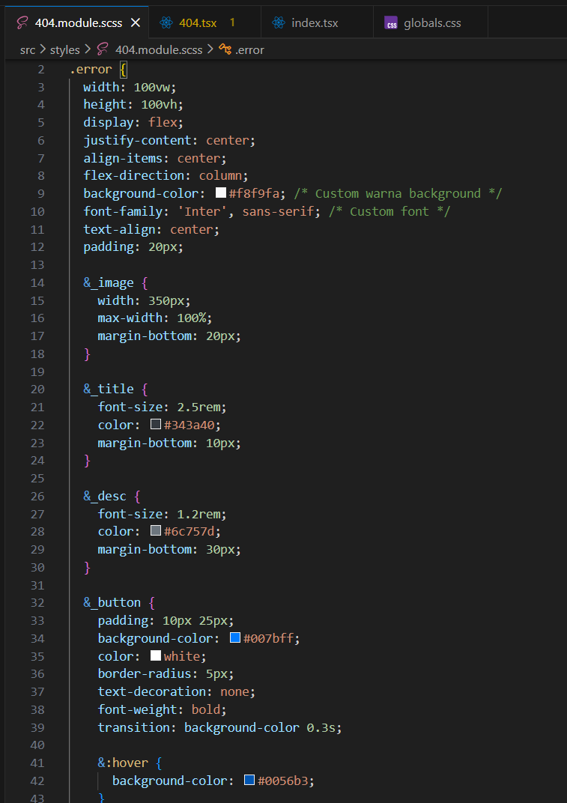

• Navbar tidak tampil di halaman 404

isi kode `index.tsx` pada appshell

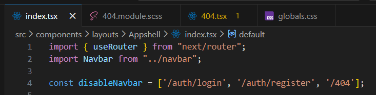

hasil

### Tugas 3 (Pengayaan)

• Tambahkan tombol:

    o “Kembali ke Home”

• Gunakan navigasi Next.js (Link)

kode tombol:

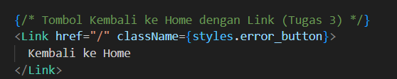

hasil

## Pertanyaan Refleksi

1. Apa fungsi utama `_document.tsx`?

> File `_document.tsx` digunakan untuk mengatur struktur dasar HTML (`<html>, <head>, <body>`) pada aplikasi Next.js. File ini juga berfungsi untuk menambahkan meta tag global untuk keperluan SEO atau verifikasi, serta untuk menambahkan CDN seperti Bootstrap, Font, atau skrip analitik secara global ke seluruh halaman aplikasi.

2. Mengapa tag `<title>` tidak disarankan di `_document.tsx`?

> Tag `<title>` tidak direkomendasikan ditaruh di `_document.tsx` karena file tersebut merender struktur secara global untuk semua halaman. Jika ditaruh di sana, seluruh halaman di website akan memiliki judul tab browser yang sama persis. Judul seharusnya bersifat unik dan spesifik untuk masing-masing halaman agar baik untuk SEO dan user experience, sehingga lebih disarankan ditaruh di masing-masing komponen halaman menggunakan next/head.

3. Apa perbedaan halaman biasa dan `halaman 404.tsx`?

> Halaman biasa dirender ketika pengguna mengakses rute URL yang memang sudah didefinisikan dan tersedia di dalam aplikasi. Sebaliknya, `halaman 404.tsx` adalah halaman khusus yang akan otomatis ditampilkan oleh sistem ketika route atau URL yang diakses oleh pengguna tidak ditemukan di dalam struktur folder aplikasi.

4. Mengapa folder public tidak perlu di-import?

> Di Next.js, folder public difungsikan sebagai tempat penyimpanan aset statis. Semua file di dalamnya secara otomatis disajikan pada root URL (/). Oleh karena itu, kita tidak perlu mengimpor file tersebut di dalam skrip JS/TS, melainkan bisa langsung memanggilnya melalui atribut source (misalnya ``) seolah-olah file tersebut berada di direktori utama server web.