# Server Side Rendering (SSR)

Pemrograman Berbasis Framework

Nama: Danendra Adhipramana

Nim: 244107023011

Prodi: D4 Teknik Informatika

# Documentations

## C. Langkah Praktikum

### Bagian 1 – Setup Halaman SSR

1. Buat file baru pada pages/products/`server.tsx`

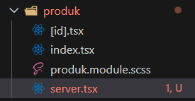

2. Modifikasi file `server.tsx`

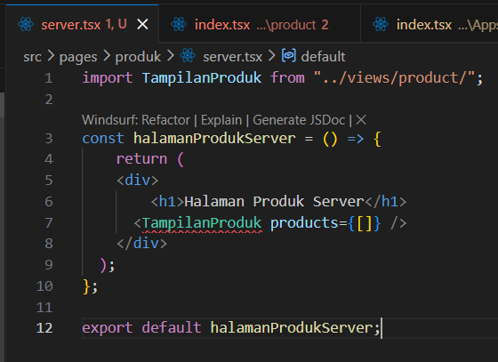

3. Jalankan browser : http://localhost:3000/produk/server

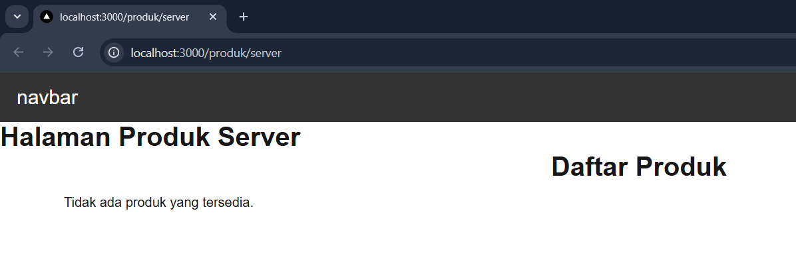

### Bagian 2 – Implementasi getServerSideProps pada server.tsx

• Tambahkan fungsi `getServerSideProps` pada `server.tsx`

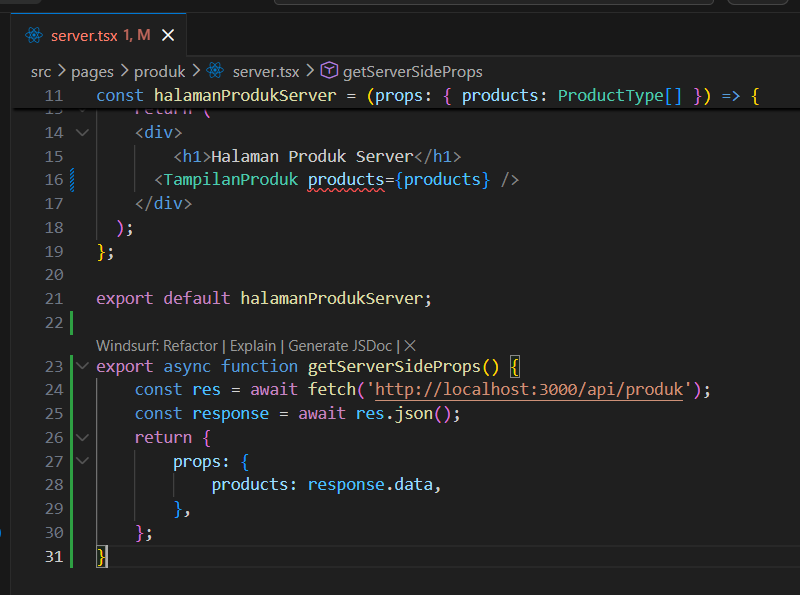

• Jalankan browser

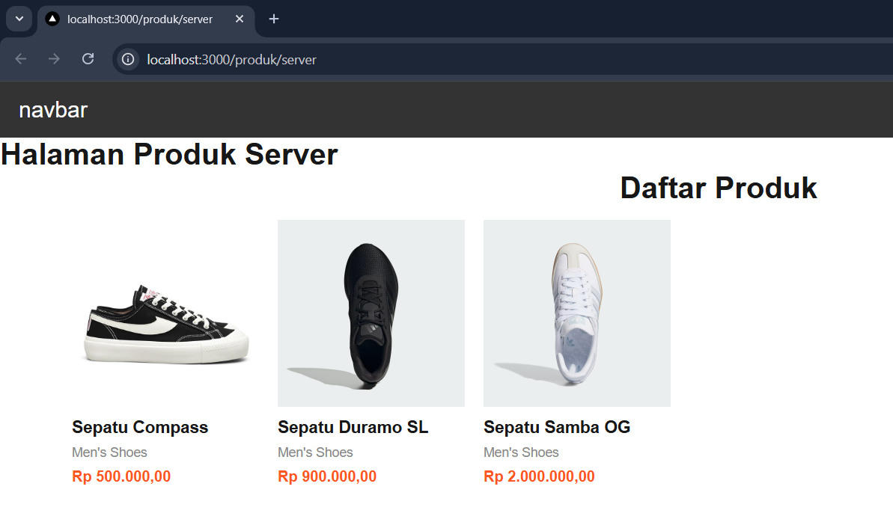

### Bagian 3 – Refactor Type ( produk type )

1. Buat folder types pada folder pages dan buat file `Product.type.ts`

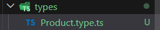

2. Modifikasi `Product.type.ts`

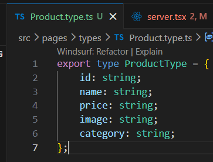

3. Setelah membuat file `Product.type.ts` maka modifikasi pada file `server.tsx` menjadi seperti berikut:

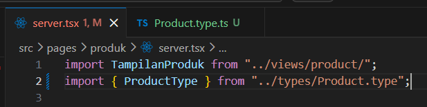

• Jalankan Browser

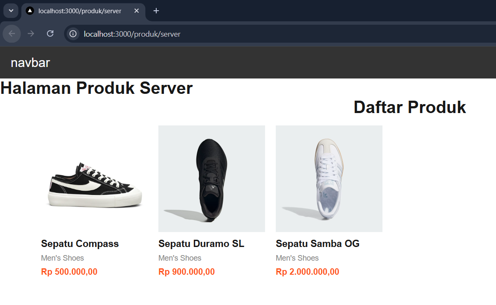

### Bagian 4 – Uji Perbedaan SSR vs CSR

Uji 1 – Skeleton

• Buka halaman CSR

• Refresh

• Skeleton muncul

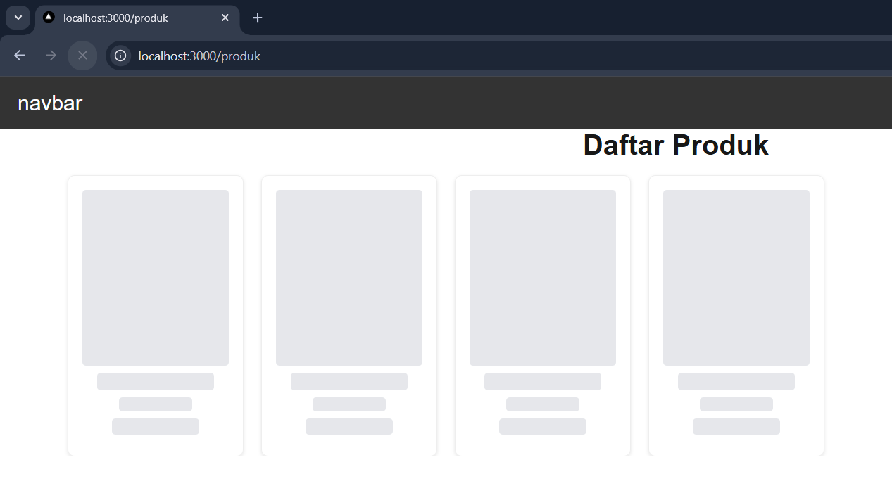

• Buka halaman SSR

• Refresh

• Skeleton tidak muncul

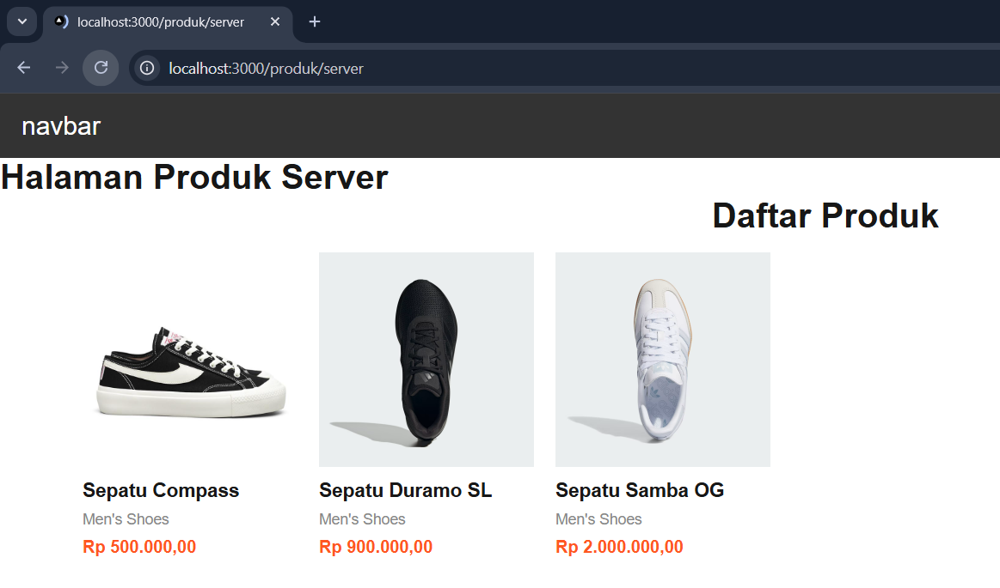

Uji 2 – Network Tab

1. Buka DevTools → Network → XHR
2. Refresh halaman CSR
→ Request API terlihat

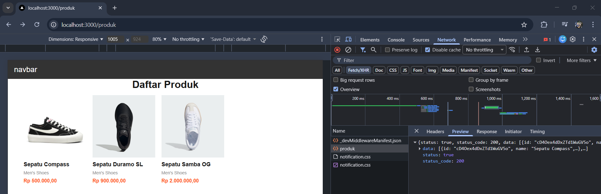

3. Refresh halaman SSR
→ Request API tidak terlihat

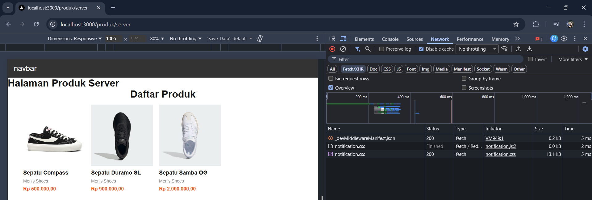

Uji 3 – Response HTML

• CSR: HTML awal kosong (berisi skeleton)

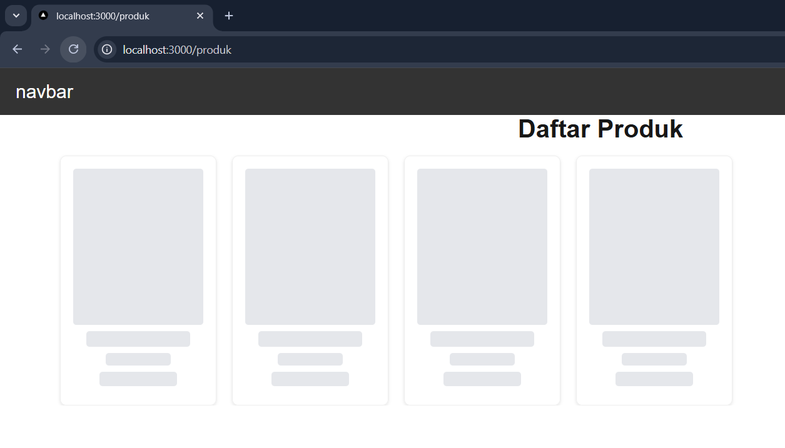

• SSR: HTML sudah berisi data produk lengkap

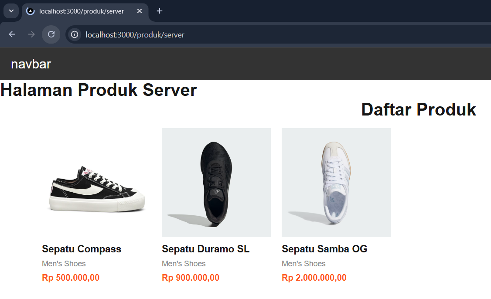

## D. Tugas Praktikum

### 1. Buat 2 halaman:

o /products (CSR)

kode: 

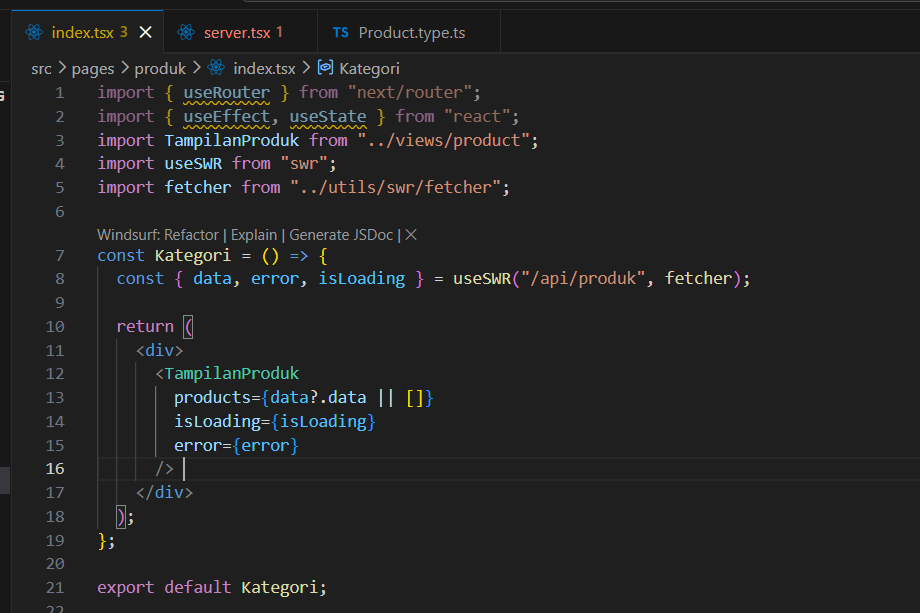

hasil: 

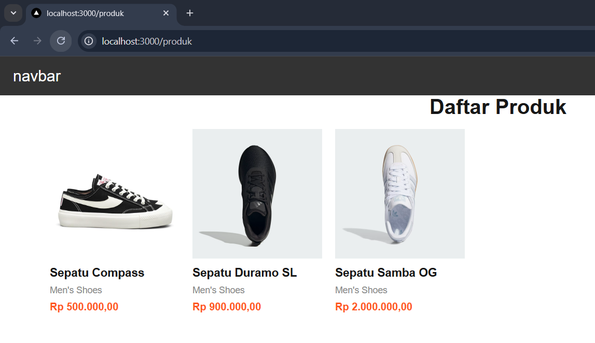

o /products/server (SSR)

kode:

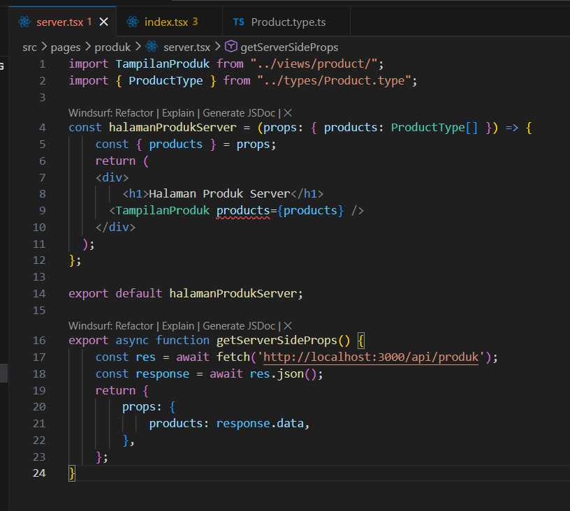

hasil

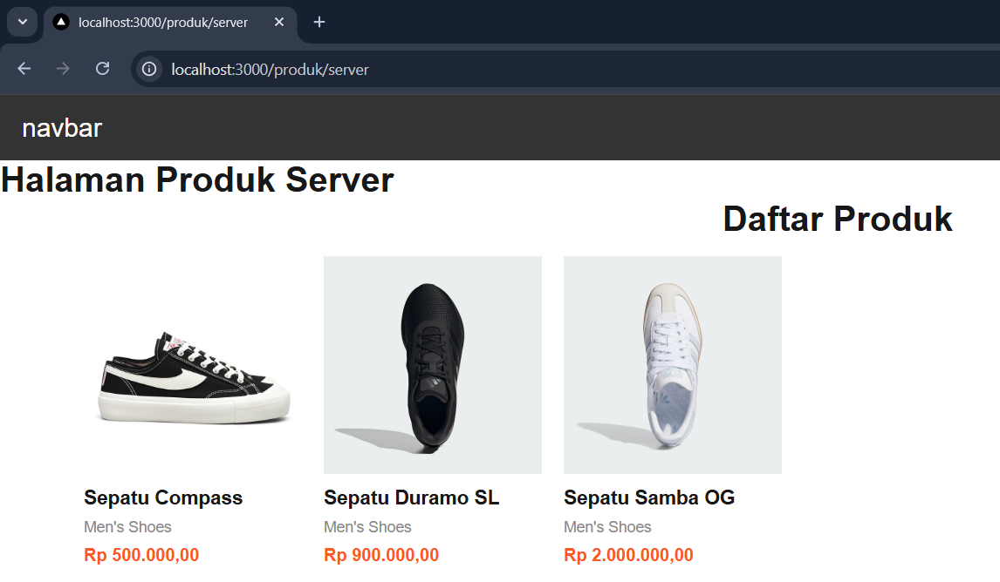

### 2. Dokumentasikan:
o Screenshot CSR

o Screenshot SSR

o Perbedaan Network tab

CSR (API terlihat) terdapat request ke product (API route) berjenis fetch/xhr setelah halaman dimuat.

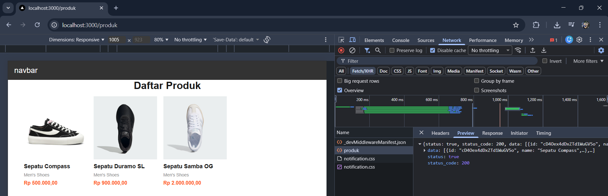

SSR (API tidak terlihat) Tidak ada request fetch/xhr ke API saat halaman dimuat, karena fetching sudah diselesaikan di backend (server) sebelum halaman dikirim ke browser.

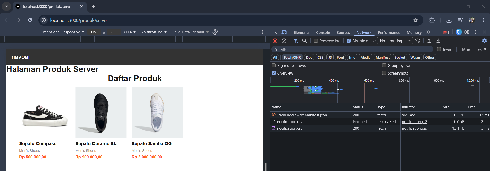

o Perbedaan View Source

CSR (Tidak terdapat Data Produk) hanya akan melihat HTML berisi elemen `
`. Data nama produk tidak ada di dalam source code awal.

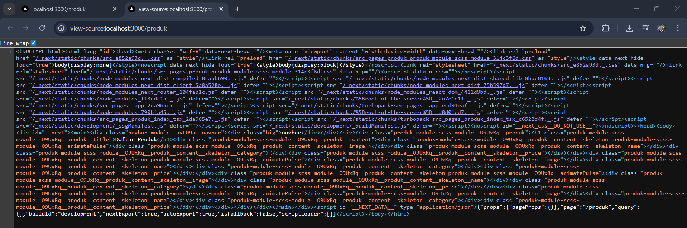

SSR (Terdapat Data Produk) 

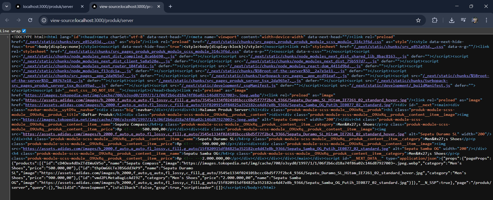

## E. Studi Analisis

1. Mengapa SSR lebih baik untuk SEO?

> Mesin pencari seperti Googlebot (Google Crawler) kadang kesulitan atau membutuhkan waktu lebih lama untuk membaca Javascript. Dengan SSR, halaman HTML yang dikirim ke browser sudah sepenuhnya berisi data (teks, judul, gambar produk) sejak detik pertama. Hal ini membuat bot mesin pencari bisa langsung membaca dan mengindeks seluruh konten website dengan sangat mudah dan akurat.

2. Kapan sebaiknya menggunakan SSR?

> SSR sebaiknya digunakan ketika kita membangun halaman yang kontennya sangat dinamis (sering berubah-ubah setiap waktu) namun sangat membutuhkan SEO yang kuat. Contoh utamanya adalah halaman detail produk e-commerce, halaman portal berita, atau artikel blog yang trending.

3. Apa kekurangan SSR dibanding CSR?

> TTFB (Time to First Byte) lebih lambat: Karena server harus memproses request, melakukan fetching data, dan menyusun HTML terlebih dahulu, respons awal yang diterima browser akan sedikit lebih lama dibanding CSR.

> Beban Server Tinggi: Setiap ada user yang membuka halaman, server harus bekerja keras merender ulang halaman tersebut. Jika traffic sangat tinggi, biaya server bisa membengkak.

> Pindah Halaman Terasa Lebih Berat: Dibanding CSR yang hanya memperbarui komponen secara instan di browser, navigasi penuh di SSR kadang terasa kurang seamless (mulus).

4. Mengapa skeleton tidak muncul pada SSR?

> Karena proses pengambilan data dilakukan di server sebelum halaman dikirim ke pengguna. Pengguna (browser) tidak akan menerima apa-apa sampai data selesai diambil dan HTML selesai dirakit. Ketika halaman akhirnya dikirim dan muncul di layar, halamannya sudah 100% jadi beserta datanya, sehingga status loading atau skeleton di sisi klien (browser) menjadi tidak ada atau tidak relevan lagi.
