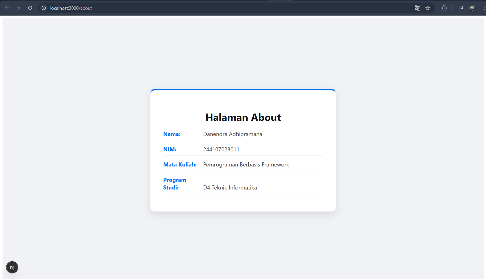
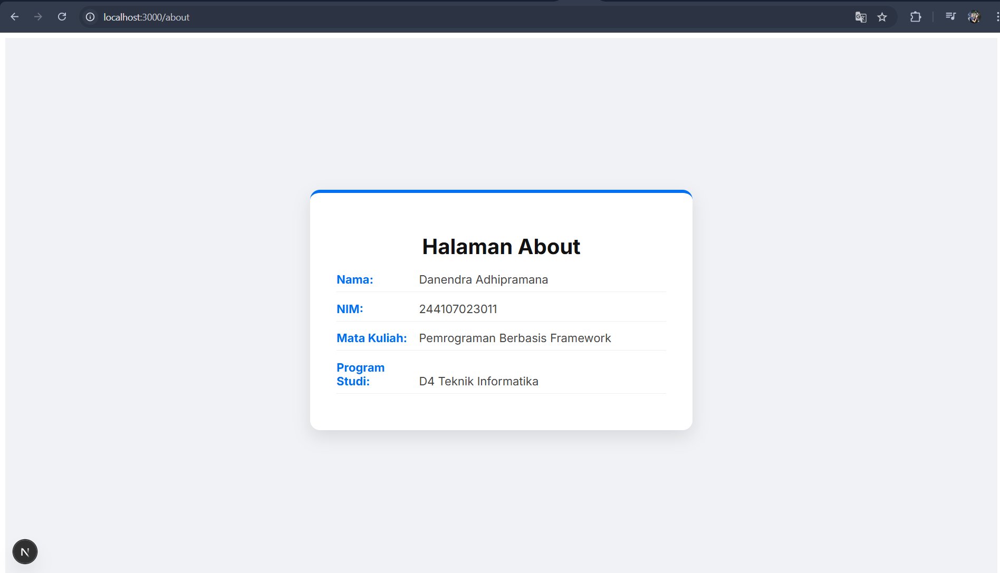

# Setup Project Next.js menggunakan Pages Router

Pemrograman Berbasis Framework

Nama: Danendra Adhipramana

Nim: 244107023011

Absen: 08

Prodi: D4 Teknik Informatika

# Documentations

## Langkah Kerja Praktikum

### Langkah 1 – Pengecekan Lingkungan

### Langkah 2 – Membuat Project Next.js

### Langkah 3 – Menjalankan Server Development

### Langkah 5 – Modifikasi Halaman Utama

### Langkah 6 – Modifikasi API

### Langkah 7 – Modifikasi Background

## Tugas Praktikum

### Tugas 1 (Wajib)
• Buat halaman baru about.js di folder pages.

• Tampilkan:

o Nama Mahasiswa

o NIM

o Program Studi

### Tugas 2 (Pengayaan)
• Tambahkan minimal 1 link navigasi dari halaman utama ke halaman about.

## Pertanyaan Refleksi

1. Mengapa Pages Router disebut sebagai routing berbasis file? 

> Karena routing ditentukan secara otomatis oleh struktur folder dan file di dalam direktori pages/. Setiap file JavaScript/TypeScript yang ditambahkan ke folder tersebut akan otomatis menjadi alamat URL (route) aplikasi.

2. Apa perbedaan Next.js dengan React standar (CRA)? 

> Next.js adalah framework yang menyediakan fitur siap pakai seperti routing berbasis file, optimasi performa otomatis, dan dukungan rendering modern (SSR/SSG). Sedangkan React standar (CRA) lebih fokus pada library UI dan biasanya hanya mendukung Client-Side Rendering (CSR) secara bawaan.

3. Apa fungsi perintah npm run dev? 

> Perintah ini berfungsi untuk menjalankan aplikasi Next.js pada server pengembangan (development server). Ini memungkinkan fitur seperti hot reloading, di mana perubahan kode akan langsung terlihat di browser tanpa perlu me-restart server secara manual.

4. Apa perbedaan npm run dev dan npm run build? 

> npm run dev: Digunakan saat proses koding (pengembangan). Server berjalan dengan fitur debugging dan tidak melakukan optimasi penuh agar proses kompilasi cepat.

>npm run build: Digunakan untuk membuat versi produksi dari aplikasi. Perintah ini mengoptimalkan kode, mengecilkan ukuran file, dan menyiapkan aplikasi agar siap di-deploy ke server asli.
+1
