# Catch-All Routing, Optional Catch-All, Linking & Navigating pada Next.js Pages
Router

Pemrograman Berbasis Framework

Nama: Danendra Adhipramana

Nim: 244107023011

Prodi: D4 Teknik Informatika

# Documentations

## D. Langkah Kerja Praktikum

### Langkah 1 – Menjalankan Project

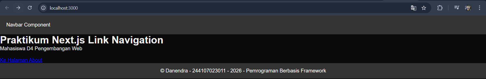

### Langkah 2 – Membuat Catch-All Route
Buat folder shop dan file […slug].tsx:

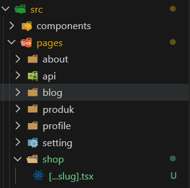

Modifikasi Isi file […slug].tsx dengan kode berikut:

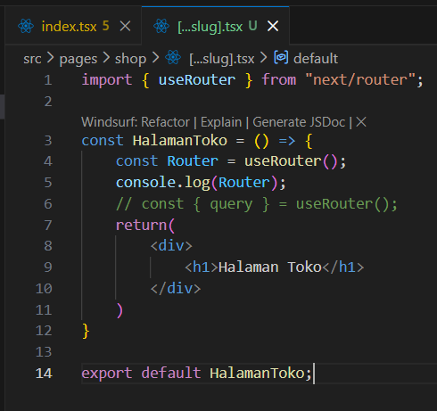

Cek menggunakan console.log apakah nilai segment berhasil didapat

• Jalankan browser dan ketik urlnya sebagai berikut

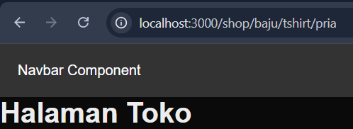

• Cek Vscode jika pada console.log dapat menampilkan nilai querynya berarti berhasil

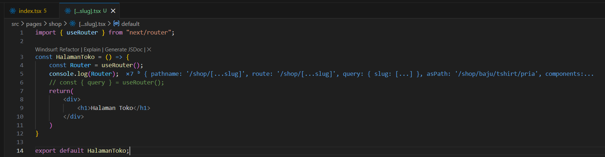

• Modifikasi [...slug].tsx untuk menampilkan nilai query

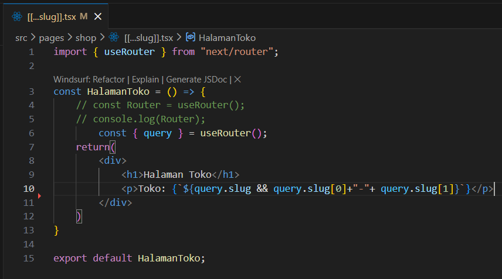

hasil

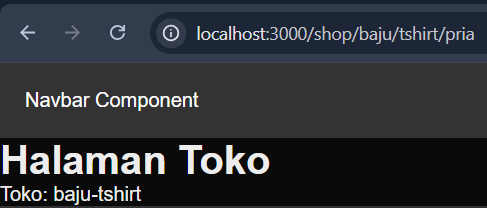

### Langkah 3 – Pengujian Catch-All Route
Akses URL berikut di browser:

/shop/clothes

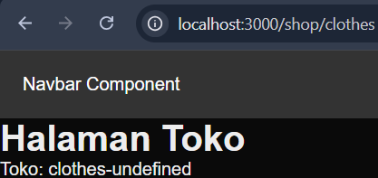

/shop/clothes/tops

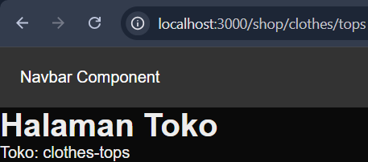

/shop/clothes/tops/t-shirt

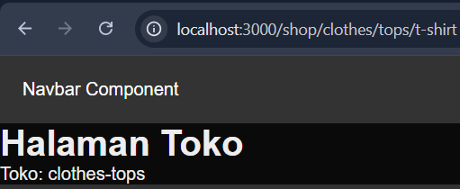

Modifikasi `[…slug].tsx` agar Berapapun banyaknya seqment tetap terbaca 

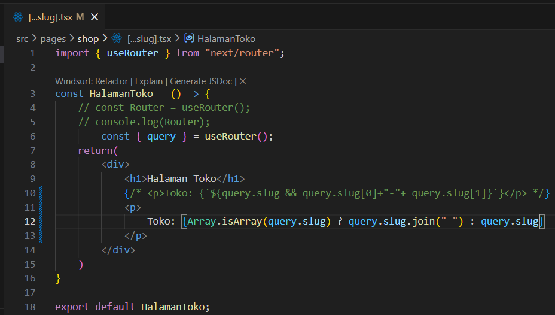

Hasil

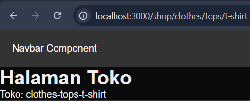

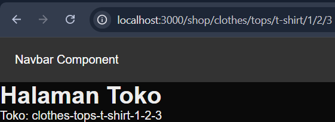

### Langkah 4 – Optional Catch-All Route
Rename file `[...slug].tsx` → `[[...slug]].tsx`

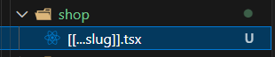

hasil

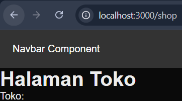

### Langkah 5 – Validasi Parameter

Kode `[[...slug]].tsx`

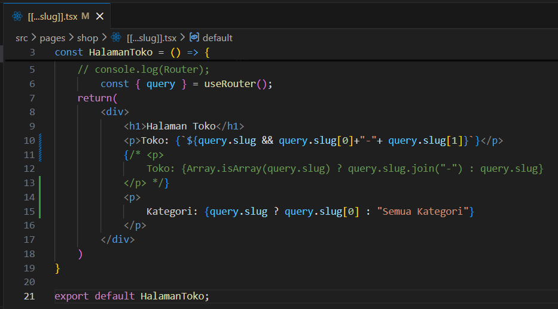

Hasil

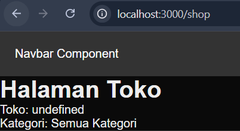

### Langkah 6 – Membuat Halaman Login & Register
Buat folder:

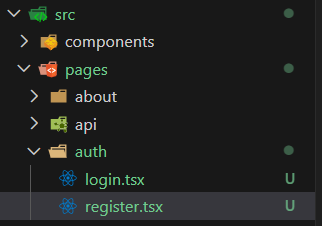

Kode `register.tsx`:

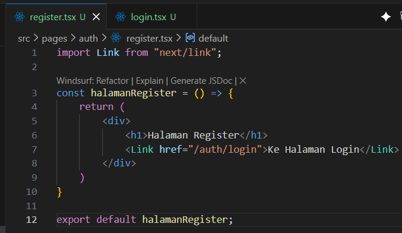

Kode `login.tsx`:

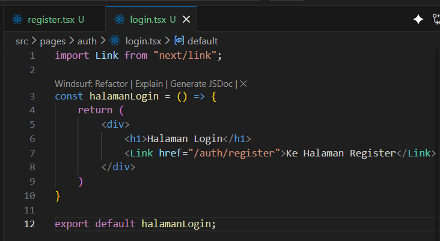

hasil `register.tsx`

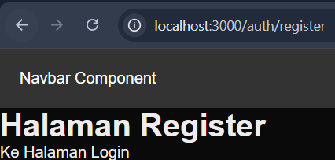

hasil `login.tsx`

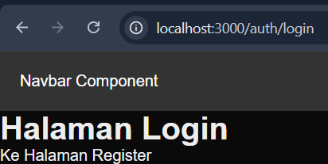

### Langkah 7 – Navigasi Imperatif (router.push)
Tambahkan button login:

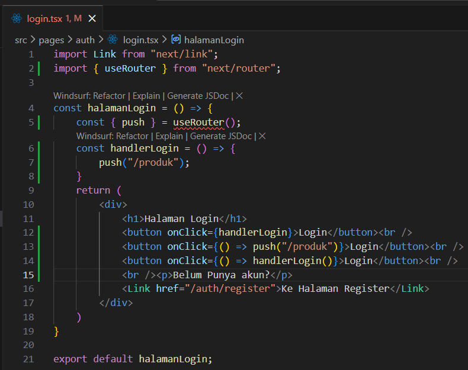

hasil

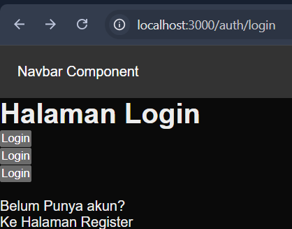

Jika di klik button login maka akan menuju /produk

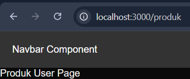

### Langkah 8 – Simulasi Redirect (Belum Login)

kode `index.tsx` pada `produk`

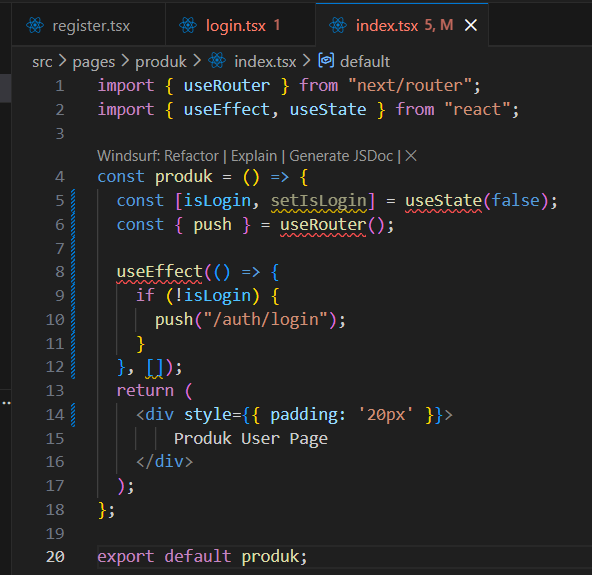

Hasil

ketika membuka url /produk

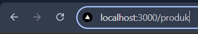

akan mengarah ke halaman login

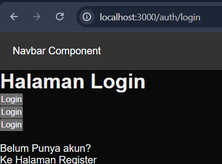

## E. Tugas Praktikum

### Tugas 1 (Wajib)
• Buat catch-all route:

• /category/[...slug].tsx

• Tampilkan seluruh parameter URL dalam bentuk list.

Struktur Folder

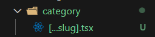

Kode `[...slug].tsx`

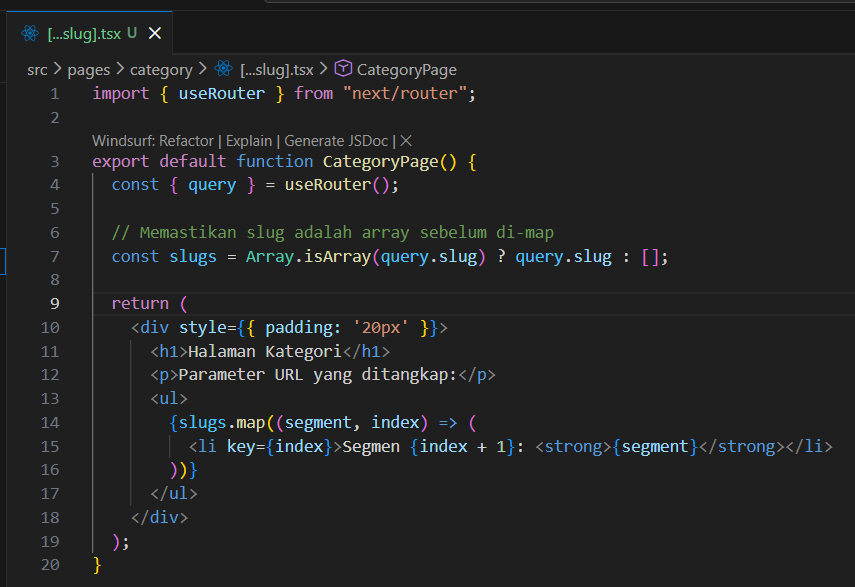

Hasil

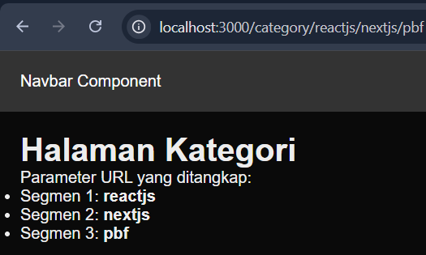

### Tugas 2 (Wajib)
• Buat navigasi:

o Login → Product (imperatif)

o Login ↔ Register (Link)

kode `register.tsx`

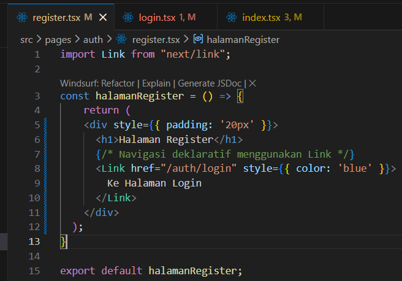

kode `login.tsx`

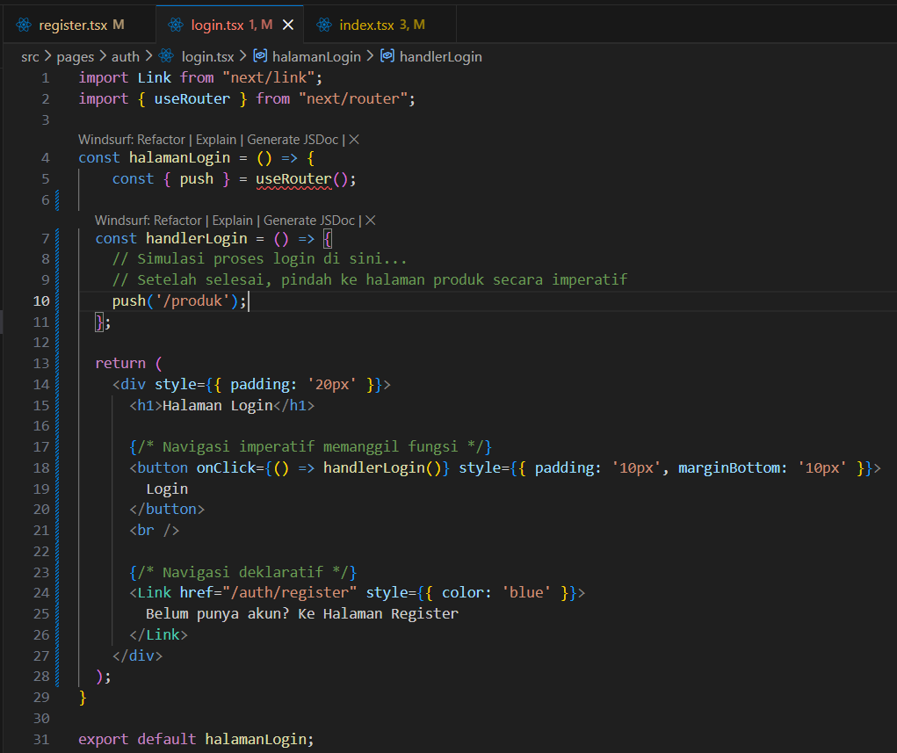

Hasil

hasil `login.tsx`

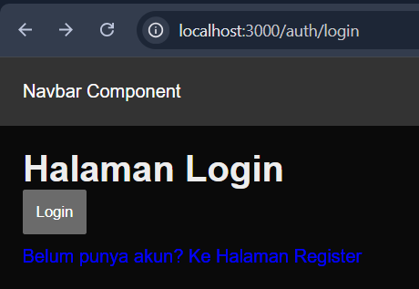

ketika klik login

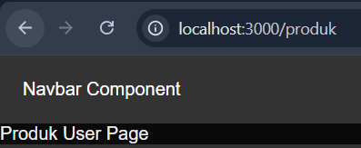

ketika klik register

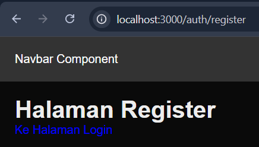

### Tugas 3 (Pengayaan)
• Terapkan redirect otomatis ke login jika user belum login.

kode `index.tsx` pada `produk`

saat akses link /produk

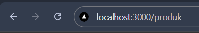

akan mengarah ke halaman login

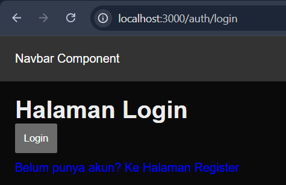

## Pertanyaan Refleksi

1. Apa perbedaan [id].js dan [...slug].js?

> [id].js adalah Dynamic Route standar yang hanya menangkap satu segmen URL setelah path foldernya. (Contoh: /produk/1 tertangkap, tapi /produk/1/detail akan error 404).

> [...slug].js adalah Catch-All Route yang menangkap seluruh sisa segmen URL tanpa batas. (Contoh: /shop/baju/tshirt/pria semuanya akan ditangkap oleh file ini).

2. Mengapa slug berbentuk array?

> Karena URL bisa terdiri dari banyak segmen yang dipisahkan oleh tanda garis miring (/). Next.js mengumpulkan semua segmen tersebut secara berurutan dan menyimpannya ke dalam bentuk array agar struktur path-nya tetap terjaga dan mudah diakses oleh developer melalui index (contoh: slug[0], slug[1]).

3. Kapan sebaiknya menggunakan Link dan router.push()?

> Gunakan <Link> (Deklaratif): Untuk navigasi standar seperti tombol menu di navbar, footer, atau teks tautan (hyperlink) murni. Ini adalah best practice untuk SEO dan aksesibilitas.

> Gunakan router.push() (Imperatif): Ketika navigasi bergantung pada sebuah kejadian (event) atau logika tertentu. Misalnya: mengarahkan user setelah tombol submit form diklik, atau mengalihkan user ke halaman login karena session habis.

4. Mengapa navigasi Next.js tidak me-refresh halaman?

> Karena Next.js menerapkan konsep Client-Side Navigation untuk komponen halamannya. Saat menggunakan <Link> atau router.push(), Next.js hanya akan mengambil data JSON atau komponen JavaScript yang dibutuhkan untuk rute tujuan secara background, lalu memperbarui antarmuka pengguna (DOM) secara langsung menggunakan React, tanpa meminta ulang seluruh dokumen HTML ke server.